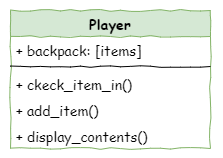

# Extension: Player Class

!!! learn "On this page we will learn"
    - why grouping related features into one class makes a program easier to manage
    - how to decide whether a feature should be an attribute or a method
    - how to refactor code out of ***main.py*** and into a class
    - how objects interact by calling each other's methods

In this extension, we'll reorganise our code by making a `Player` class. This gives us a player object that can hold all the player's features, like health, items, gear and weapons. The first thing we'll move into it is the player's inventory: the backpack.

## Planning

Right now, all the backpack code is in ***main.py***. Before we create the `Player` class, we need to find that code and decide which parts should move into the class. Let's start with ***main.py*** from the end of [Stage 8](../stages/stage_8.md#final-code).

```python linenums="1" hl_lines="54 83-86 103-104 110-115"
--8<-- "examples/ext_player/step01/main.py"
```

There are four places where ***main.py*** uses the player's backpack:

1. **line 54** → creates the `backpack` variable as an empty list.
2. **lines 83–86** → check whether the chosen weapon is in the backpack.
3. **lines 103–104** → add an item to the backpack.
4. **lines 110–115** → display the contents of the backpack.

If we move these features to a `Player` class, we need to think about what kind of feature each one is:

1. the backpack describes part of the player → **attribute**
2. checking for a weapon in the backpack is an action → **method**
3. adding an item to the backpack is an action → **method**
4. displaying the contents of the backpack is an action → **method**

So the class diagram looks like this:



Now that we have a plan, let's build it.

## Coding

We'll change the code in small steps. This makes it easier to test as we go, and to check that we haven't accidentally created any new bugs.

### Create the Player class

Create a new file called ***player.py*** in the same folder as the other files, and add the code below.

```python linenums="1" hl_lines="1 3 5-6"
--8<-- "examples/ext_player/step02/player.py"
```

??? note "Code explanation"
    - **line 3** → defines the `Player` class.
    - **line 5** → defines the dunder init method, which runs when we create the player.
    - **line 6** → creates the `backpack` attribute as an empty list.

### Replace the backpack variable

Now let's create a player object in ***main.py*** and use its backpack instead of the `backpack` variable. Make the highlighted changes below, and **delete** the old `backpack = []` line under `# initialise variables`.

```python linenums="1" hl_lines="6 52-53 86 106 113 117"
--8<-- "examples/ext_player/step03/main.py"
```

??? note "Code explanation"
    - **line 6** → imports the `Player` class from ***player.py***.
    - **line 53** → creates the player object and stores it in `player`.
    - **line 86** → loops through `player.backpack` instead of `backpack`.
    - **line 106** → adds the item to `player.backpack`.
    - **line 113** → checks whether `player.backpack` is empty.
    - **line 117** → loops through `player.backpack` to display each item.

!!! primm "PRIMM"
    1. **Predict** what you think will happen. Be specific.
    2. **Run** the program. Test every command that uses the backpack: `take`, `backpack` and `fight`.
    3. It should work exactly as before. Refactoring changes *how* the code is written, not *what* it does.

### The add_item method

To make our code cleaner, let's move the backpack code into the `Player` class. We'll start with an `add_item` method that puts items into the backpack.

In ***player.py***, add the highlighted code below.

```python linenums="1" hl_lines="8-10"
--8<-- "examples/ext_player/step04/player.py"
```

??? note "Code explanation"
    - **line 8** → defines the `add_item` method, which takes the item to add.
    - **line 9** → adds the item to this player's backpack.
    - **line 10** → tells the player which item they picked up.

Now let's use the method in ***main.py***. In the `take` command, replace the two lines that append the item and print the message with the highlighted line below.

```python linenums="1" hl_lines="106"
--8<-- "examples/ext_player/step05/main.py"
```

??? note "Code explanation"
    - **line 106** → calls the player's `add_item` method with the room's item, which adds it to the backpack and prints the message.

!!! primm "PRIMM"
    1. **Predict** what you think will happen. Be specific.
    2. **Run** the program, and check that we can still add items to the backpack.

### The display_contents method

Next, let's move the code that shows what's in the backpack. Go back to ***player.py*** and add the highlighted code below.

```python linenums="1" hl_lines="12-18"
--8<-- "examples/ext_player/step06/player.py"
```

??? note "Code explanation"
    - **line 12** → defines the `display_contents` method.
    - **lines 13–14** → if the backpack is empty, tells the player…
    - **line 15** → …otherwise…
    - **lines 16–18** → …prints a heading, then the name of each item with a capital letter.

Then go back to ***main.py***. In the `backpack` command, replace the six lines under `elif command == "backpack":` with the highlighted line below.

```python linenums="1" hl_lines="112"
--8<-- "examples/ext_player/step07/main.py"
```

??? note "Code explanation"
    - **line 112** → calls the player's `display_contents` method to show what's in the backpack.

!!! primm "PRIMM"
    1. **Predict** what you think will happen. Be specific.
    2. **Run** the program, and check that we can still see everything in the backpack.

### The check_item_in method

Finally, we need to change how the `fight` command uses the backpack. This time it's more than a simple swap. We'll make the backpack give us the whole item, not just `item.name`. This will make it easier later to add things like weapon damage and health points.

In ***player.py***, add the highlighted code below.

```python linenums="1" hl_lines="20-24"
--8<-- "examples/ext_player/step08/player.py"
```

This code is different, so let's **investigate** it.

??? note "Code explanation"
    - **line 20** → defines the `check_item_in` method, which takes the name of the item as a string.
    - **line 21** → loops through every item object in the backpack.
    - **line 22** → checks whether this item's name matches the name we're looking for…
    - **line 23** → …and if it does, returns that item object. `return` also ends the method straight away.
    - **line 24** → returns `None` if no item in the backpack has that name.

In ***main.py***, change the `fight` command to match the highlighted lines below.

```python linenums="1" hl_lines="84-87 96"
--8<-- "examples/ext_player/step09/main.py"
```

!!! primm "PRIMM"
    1. **Predict** what you think will happen. Be specific.
    2. **Run** the program. Check that every fight option still works: with the right weapon, the wrong weapon, and a weapon we don't have.
    3. Time to **investigate** the code. What does each line do?

??? note "Code explanation"
    - **line 84** → stores what the player typed in `choice`. We changed the variable name because `weapon` will now hold an item object.
    - **line 85** → calls `check_item_in`, so `weapon` holds the item object if it's in the backpack, or `None` if it isn't.
    - **line 86** → checks whether `weapon` is an item object (truthy) or `None` (falsy).
    - **line 87** → passes `weapon.name` to the `fight` method, because `fight` still expects a string.
    - **line 96** → prints what the player typed, because when `weapon` is `None` it doesn't have a name.
