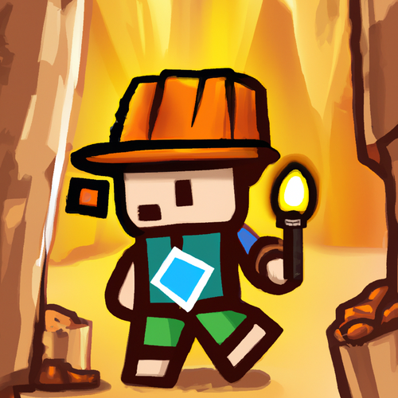

# Deepest Dungeon - Python OOP

{ width="360" }

This site guides us through the fundamentals of **object-oriented programming** (OOP) in Python by building a text-based adventure game. Each stage adds a new feature to the dungeon, and shows how classes, objects, methods and inheritance fit together in a real program. We use **Thonny** to write and run our code.

## How to use this site

- Start with the [Introduction for Students](start/students.md) to set up Thonny and your project folder, then read the [OOP Primer](start/oop_primer.md).
- Work through the stages in order, starting with [Stage 1: Create Rooms](stages/stage_1.md), at your own pace. If you finish early, try the [Extensions](extensions/player.md).
- Your teacher will live code each stage in class. That's the minimum progress to aim for. If you fall behind, use this site to catch up.
- Each stage uses **PRIMM**: we **predict** what code will do, **run** it, **investigate** how it works, **modify** it, and finally **make** our own features in the exercises.

## Callouts

Coloured boxes called **callouts** highlight different kinds of information. Each type of callout has its own colour and icon, so we can tell at a glance what it's for.

!!! learn "Learning intentions"
    This callout is at the top of every stage. It lists what we will learn in that stage.

!!! primm "PRIMM"
    This callout comes after each example program. It asks us to **predict** what the code will do, **run** it, and **investigate** how it works. Sometimes it asks us to **modify** the code.

!!! note "Code explanation"
    This callout comes after each PRIMM callout and gives a line-by-line explanation of the new code. On the stage pages it starts closed, so we can make our own prediction first. Click its title to open it.

!!! tip "Tip"
    This callout gives extra information, such as definitions, background facts, comparisons and hints.

!!! warning "Warning"
    This callout warns us about mistakes that are easy to make, or things that will stop our program working.

## Code blocks

Programs are shown in **code blocks** like this one:

```python linenums="1" hl_lines="3"
# main.py

print("Welcome to the Deepest Dungeon")
```

- The first line is a comment with the **file name**, because our game is split across several files.
- The **line numbers** on the left match the line numbers used in the Code explanation and in error messages.
- **Highlighted lines** show the lines that are new or have changed since the last version of the file. Only these lines are explained in the Code explanation.
- The **copy** button in the top-right corner of a code block copies the code, so we can paste it into Thonny.

Code blocks without colours show what appears in the **Shell** when we run a program, or the **pseudocode** that plans a stage.

## Error messages

Error messages are shown in red code blocks like this one:

``` { .text .error linenums="1" }
Traceback (most recent call last):
  File "main.py", line 3, in <module>
NameError: name 'prnt' is not defined
```

Under each error message, the stage breaks it down line by line, so we learn how to read the error and fix our code.

## Tutorial files

Download the [tutorial files](downloads/deepest_dungeon.zip). The zip has a folder for each stage and extension, containing the finished code for that stage.

If you fall behind or your code stops working, you can pick up from a checkpoint:

1. Download and unzip the file into your own folder.
2. Copy the files from the folder of the last stage you finished into your ***deepest_dungeon*** folder.
3. Open ***main.py*** in Thonny (**File** → **Open**) and start the next stage.
