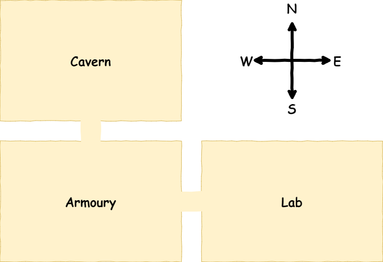
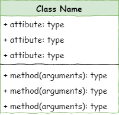
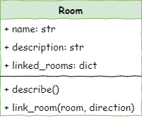

# Stage 1: Create Rooms

!!! learn "In this lesson we will learn"
    - how classes, attributes and methods work together
    - how to read a UML class diagram and find the class name, attributes and methods
    - how to make a Python class with an `__init__` method and a method of our own
    - how to create objects from a class and give their attributes values
    - how to link objects together and show those links in our output

!!! terms "Terminology"
    - **computational thinking** – breaking a real-world problem into precise, ordered and unambiguous steps that a computer can follow exactly.
    - **pseudocode** – the steps of a program written in plain English instead of real code, so we can plan the logic without worrying about exact syntax.
    - **class diagram** – a UML (Unified Modelling Language) drawing of a class as a table with three rows: the class name, its attributes and its methods.
    - **string** – a data type that stores text, written inside quotation marks.
    - **dictionary** – a Python collection that stores information in key:value pairs, so we can look up a key to get its value.
    - **argument** – a piece of information we pass into a method when we call it, such as the direction for `link_rooms`.
    - **comment** – a line starting with `#` that Python ignores, used to explain our code or label the file.
    - **naming convention** – an agreed way of writing names, such as `snake_case` for most Python names and `CamelCase` for class names, that makes code easier to read.
    - **constructor** – the special `__init__` method, called the dunder init, that runs automatically each time we create an object and sets up its attributes.
    - **self** – the first argument of every method, which means "this object" so the method can use that object's own attributes.
    - **None** – a special Python value that means "nothing", often used to create an attribute before it has a real value.
    - **key:value pair** – one entry in a dictionary, where the key is the label we look up and the value is the information stored with it.

<iframe width="560" height="315" src="https://www.youtube-nocookie.com/embed/GeSTPYPPEfU" title="YouTube video player" frameborder="0" allow="accelerometer; autoplay; clipboard-write; encrypted-media; gyroscope; picture-in-picture; web-share" allowfullscreen></iframe>

## How we plan

When we work with computers, we need to break problems into clear, logical steps that a computer can follow exactly. Humans can rely on shortcuts, guesses and experience to fill in gaps, but computers can't. A computer only does exactly what it's told, so every step must be precise, ordered and unambiguous.

This **computational thinking** helps us turn a messy real-world problem into a series of simple, complete instructions that a computer can carry out without ever needing to "figure things out" on its own.

To help with this planning we will use **pseudocode**. Pseudocode is a simple way of writing out the steps of a program in plain English instead of real code, so we can focus on the logic without worrying about exact syntax. It shows what the program should do, in order, using clear instructions like IF, ELSE, REPEAT and OUTPUT.

Pseudocode doesn't run on a computer, but it helps us plan our thinking before we write real code. That makes mistakes easier to spot and the final program easier to build.

## Planning

In this stage we want to create three rooms and link them together. Below is a rough map of our dungeon.



To do this we need two files:

- ***main.py*** → runs the program
- ***room.py*** → stores the `Room` class

### Pseudocode

```text title="Stage 1 pseudocode"
- Define the Room class
- Create Room objects
- Describe Room objects
- Link the Room objects
- Include the linked Rooms when each Room object is described
```

### Class diagram

UML **class diagrams** are a simple way to show what a class looks like and how it works with other classes.

In UML, a class is drawn as a table with three rows.



- The class name goes in row 1.
- The class attributes go in row 2, along with their data types.
- The class methods go in row 3, along with their arguments and the data type of any returned value.

The class diagram for the `Room` class is:



From the diagram we can tell:

- The class name is `Room`.
- The attributes are:
    - `name`, which is a **string**
    - `description`, which is a **string**
    - `linked_rooms`, which is a **dictionary**
- The methods are:
    - `describe`, which takes no arguments and returns nothing
    - `link_rooms`, which returns nothing and takes two arguments:
        - `room_to_link`
        - `direction`

!!! tip "Diagram and code names"
    The class diagram image labels the method `link_room(room, direction)`. In our code it's called `link_rooms(room_to_link, direction)`. Use the name from the code.

## Define the Room class

Open Thonny and create a new file. Then type the code below into it.

```python linenums="1" hl_lines="1 3"
--8<-- "examples/stage_1/step01/room.py"
```

??? note "Code explanation"
    - **line 3** → defines the `Room` class. Everything indented under this line belongs to the class.

The first line, `# room.py`, is a comment with the file name. Our game is split across several files, so this helps us keep track of which file we're working on.

!!! tip "Naming conventions"
    Most Python names use `snake_case`, but class names use `CamelCase`, like `Room`.

    Python won't give an error if we break this convention, but following it makes our code easier to read and maintain.

    File names should stay lower case. This matters when we import our class from the file.

### Dunder init method

Every Python class has a special method called the **dunder init**. Its real name is `__init__`. The "double underscores" are why we call it **dunder**.

The dunder init runs automatically every time we create a new object from a class. It sets up the object's attributes and gets it ready to use. We can also use it to run any other set-up the object needs.

Let's make a dunder init for our `Room` class.

```python linenums="1" hl_lines="5-6 8-9"
--8<-- "examples/stage_1/step02/room.py"
```

??? note "Code explanation"
    - **line 5** → starts the dunder init method.
        - `self` is always the first argument of a method. It means "this object". If we make a `cavern` room, then inside the code `self` means "this specific cavern room".
        - `room_name` is the text we give the room when we create it.
    - **line 8** → sets the room's name. `self.name` means "this room's name", and `room_name.lower()` changes the name to lower case before storing it.
    - **line 9** → creates the room's `description` attribute and sets it to `None` for now. It's good practice to create every attribute inside `__init__`, even if it doesn't have a value yet.

### Save ***room.py***

!!! warning "Saving files"
    Our program uses several files, so where we save them matters.

    ***main.py*** will import classes from our other files. The first place Python looks for them is the folder ***main.py*** is saved in.

    Check that the file names are correct, including lower case letters and the ***.py*** extension.

Save the file as ***room.py*** in the ***deepest_dungeon*** folder we made in the [Introduction for Students](../start/students.md#create-a-project-folder).

## Create Room objects

Create a new file and save it as ***main.py*** in the ***deepest_dungeon*** folder. This file controls our game.

Type the following code into ***main.py***.

```python linenums="1" hl_lines="1 3 5-6 8 10 12"
--8<-- "examples/stage_1/step03/main.py"
```

We're about to run our program for the first time. Throughout this course we'll use the **PRIMM** process to learn from each piece of code. PRIMM stands for:

- **Predict**: before we run the code, we predict what we think will happen.
- **Run**: we run the program and see how accurate our prediction was. If it was wrong, how was the result different?
- **Investigate**: we go through the code and work out what each line does.
- **Modify**: we change the code and see what results we get.
- **Make**: we use our new understanding to make something new.

Let's try it now.

!!! primm "PRIMM"
    1. **Predict** what you think will happen. Be specific.
    2. **Run** the program.
    3. Time to **investigate** the code. What does each line do?

??? note "Code explanation"
    - **line 3** → imports our own `Room` class from the file ***room.py***. The class name is CamelCase (`Room`), and the file name is lower case (`room`).
    - **line 6** → creates our first room.
        - `Room("Cavern")` makes a new `Room` object. When it's created, the `__init__` method runs automatically and saves `"Cavern"` as the room's name.
        - `cavern =` stores the new room object in a variable called `cavern`.
    - **line 8** → makes another `Room` object called `"Armoury"` and stores it in `armoury`.
    - **line 10** → makes a third room called `"Laboratory"` and stores it in `lab`.
    - **line 12** → prints the `name` attribute stored inside the `cavern` object.

!!! primm "PRIMM"
    Time to **modify** the code. Can you make it print the names of the other two `Room` objects?

## Describe Room objects

If we look at the `Room` class, we'll notice that the `description` attribute currently stores `None`.

```python linenums="1" hl_lines="9"
--8<-- "examples/stage_1/step04/room.py"
```

We want our rooms to have descriptions, so let's give them some values in ***main.py***.

```python linenums="1" hl_lines="7 10 13 16"
--8<-- "examples/stage_1/step05/main.py"
```

!!! primm "PRIMM"
    1. **Predict** what you think will happen. Be specific.
    2. **Run** the program.
    3. Time to **investigate** the code. What does each line do?

??? note "Code explanation"
    - **line 7** → sets the `description` attribute of the `cavern` room to a sentence that describes it.
    - **line 10** → gives the `armoury` room its description.
    - **line 13** → gives the `lab` room its description.
    - **line 16** → prints the cavern's description.

!!! primm "PRIMM"
    Time to **modify** the code. Can you make it print the descriptions of the other two `Room` objects?

### Describe method

It's better programming practice to use methods than to grab an object's attributes directly. In the class diagram, the `Room` class has a `describe()` method for this.


Using a method like `describe()` is a cleaner and safer way to show a room's details, so let's add it. Go back to ***room.py*** and add the highlighted code below.

```python linenums="1" hl_lines="10-13"
--8<-- "examples/stage_1/step06/room.py"
```

??? note "Code explanation"
    - **line 10** → defines the `describe` method. `self` means "this object", just like in `__init__`. The method is indented one level because it belongs to the class.
    - **line 12** → puts the room's name into a sentence and prints it. The `\n` adds a blank line first.
    - **line 13** → prints the room's description.

Then go back to ***main.py*** and replace lines 15 and 16 with the highlighted code below.

```python linenums="1" hl_lines="15-18"
--8<-- "examples/stage_1/step07/main.py"
```

!!! primm "PRIMM"
    1. **Predict** what you think will happen. Be specific.
    2. **Run** the program.
    3. Time to **investigate** the code. What does each line do?

??? note "Code explanation"
    - **line 16** → runs the `describe` method of the `cavern` room.
    - **line 17** → runs the `describe` method of the `armoury` room.
    - **line 18** → runs the `describe` method of the `lab` room.

## Link rooms

If we look at our map, we'll notice that the rooms are linked, so our adventurer can move between them.

- Cavern ↓ Armoury
- Armoury ↑ Cavern
- Armoury → Lab
- Lab ← Armoury


The class diagram shows that each room uses an attribute called `linked_rooms` and a method called `link_rooms` to connect rooms together.

`linked_rooms` is a dictionary. A dictionary stores information in **key:value** pairs.

- The **key** will be a direction like north, south, east or west.
- The **value** will be the `Room` object in that direction.

For example, the Armoury's `linked_rooms` dictionary will look like this:

```python
{
  "north" : cavern,
  "east" : lab
}
```

!!! tip "Dictionaries"
    A Python dictionary is like a real-life dictionary, but for our code.

    In a real dictionary, we look up a **word** to find its **meaning**. In a Python dictionary, we look up a **key** to get its **value**.

    Dictionaries are useful when we want to group information together and label it clearly so we can find it later.

The `link_rooms` method takes two pieces of information: the room we want to connect and the direction it's in. It adds this to the `linked_rooms` dictionary, so the room knows what's next to it.

Let's build it. First go back to ***room.py*** and add the highlighted code below.

```python linenums="1" hl_lines="9 16-18"
--8<-- "examples/stage_1/step08/room.py"
```

??? note "Code explanation"
    - **line 9** → creates the `linked_rooms` attribute as an empty dictionary.
    - **line 16** → defines the `link_rooms` method. It takes `self` ("this room"), `room_to_link` (the room to connect to) and `direction` (north, south, east or west).
    - **line 18** → adds the connection to the dictionary.
        - `direction.lower()` turns the direction into lower case and uses it as the key.
        - `= room_to_link` stores the room as the value for that direction.
        - If the direction wasn't there yet, it's added. If it was, the old value is replaced.

Then open ***main.py*** and add the highlighted code below.

```python linenums="1" hl_lines="15-19"
--8<-- "examples/stage_1/step09/main.py"
```

!!! primm "PRIMM"
    1. **Predict** what you think will happen. Be specific.
    2. **Run** the program.
    3. Time to **investigate** the code. What does each line do?

??? note "Code explanation"
    - **line 16** → links the `armoury` to the `"south"` of the `cavern`.
    - **line 17** → links the `cavern` to the `"north"` of the `armoury`.
    - **line 18** → links the `lab` to the `"east"` of the `armoury`.
    - **line 19** → links the `armoury` to the `"west"` of the `lab`.

Did you predict that nothing would change? The rooms are linked, but we aren't showing the links yet. Notice that each connection needs two calls to `link_rooms`, one for each direction.

## Include linked rooms in the description

Now let's show the linked rooms in each room's description. Go to ***room.py*** and add the highlighted code below.

```python linenums="1" hl_lines="15-16"
--8<-- "examples/stage_1/step10/room.py"
```

!!! primm "PRIMM"
    1. **Predict** what you think will happen. Be specific.
    2. **Run** the program.
    3. Time to **investigate** the code. What does each line do?

??? note "Code explanation"
    - **line 15** → loops through every key in the `linked_rooms` dictionary. Dictionaries can be used in a `for` loop, just like lists, and `direction` holds each key in turn (like `"north"` or `"east"`).
    - **line 16** → prints a sentence showing which room is in that direction. `self.linked_rooms[direction].name` gets the name of the room linked in that direction.

## Exercises

So far we've used the first four steps of PRIMM. Now it's time to **make**.

### Exercise 1

Can you add one or more rooms to the dungeon? It should:

- create one or more new `Room` objects with a description
- link each new room to at least one of the existing rooms, in both directions
