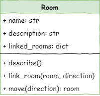

# Stage 2: Movement

!!! learn "In this lesson we will learn"
    - what event-driven programming is and the role of a main loop
    - how methods use arguments and return values to control behaviour
    - how to create a method that returns a new state
    - how to build a main loop that reads user input and runs event handlers
    - how to test branching code and handle invalid commands

!!! terms "Terminology"
    - **state** – the situation a program is in at a particular moment, such as which room the player is in.
    - **state machine** – a way of thinking about a program as always being in one state, with rules that decide the next state when an event happens.
    - **flag variable** – a variable that stores `True` or `False` to control part of a program, such as `running` keeping the main loop going.
    - **event handler** – the code that responds to a particular event, such as moving the player when they type a direction.
    - **branch** – one of the possible paths through code that uses `if`, `elif` and `else`, each of which needs to be tested.
    - **testing table** – a table that lists each test with its expected result and actual result, so we can spot any differences.

<iframe width="560" height="315" src="https://www.youtube-nocookie.com/embed/hZd1FcDApCI" title="YouTube video player" frameborder="0" allow="accelerometer; autoplay; clipboard-write; encrypted-media; gyroscope; picture-in-picture; web-share" allowfullscreen></iframe>

## Introduction

In Stage 1 we made three rooms, connected them, and got the program to describe each one. That was a good start, but it's not much of a game yet. In Stage 2 we'll write code that lets the player move between rooms, which means changing the game's **state** (for example, which room the player is in), and we'll build the **main loop**.

!!! tip "State machines"
    A **state machine** is a way of thinking about how a program changes as things happen. At any moment, the program is in one **state** (like being in a certain room in our game). When an event happens, such as the player typing a command, the program follows a rule that decides what the next state should be.

    For example, typing "east" might move us from the Armoury to the Lab. Each state has certain things we can do, and each action can move us to a new state. It's like following a map where every choice leads to a different place, and the program always knows exactly where it is and what it should do next.

The main loop is a key part of **event-driven programming**. Our ***main.py*** file will set up the game and create all the objects it needs. Then it will enter the **main loop**, where the program waits for the player to type something and then reacts to that input.

!!! tip "Event-driven programming"
    **Event-driven programming** is when a program doesn't just run from top to bottom, but waits for things to happen and reacts to them. These things are called **events**, like the user typing a command, clicking a button, or a sensor sending data.

    The program sits in a loop, **listening** for these events. When one occurs, it runs the code that matches that event. This makes programs more flexible because they only do something when there's a reason to, just like we don't answer someone until they speak to us first.

### Pseudocode

```text title="Stage 2 pseudocode"
- Create the move method
- Initialise the starting room
- Create the main loop, which:
    - describes the current room
    - accepts user input
    - responds to user input
```

### Class diagram

We've updated the `Room` class diagram for Stage 2.



Notice the new method `move(direction):room`. It:

- accepts one argument (`direction`)
- returns a `Room` object

## Create the move method

Open ***room.py*** and add the highlighted code below.

```python linenums="1" hl_lines="22-28"
--8<-- "examples/stage_2/step01/room.py"
```

We need to build the main loop before we can use this method, but let's **investigate** it now.

??? note "Code explanation"
    - **line 22** → defines the `move` method, which takes one argument: the direction the player wants to go.
    - **line 24** → checks whether the direction is one of the keys in this room's `linked_rooms` dictionary.
    - **line 25** → returns the room linked in that direction, so the player moves there.
    - **lines 26–27** → otherwise tells the player they can't go that way…
    - **line 28** → …and returns `self`, so the player stays in the same room.

## Initialise the starting room

Now go to ***main.py*** and make the highlighted changes below.

```python linenums="1" hl_lines="21-26 28-29"
--8<-- "examples/stage_2/step02/main.py"
```

??? note "Code explanation"
    - **lines 21–26** → wrap the room descriptions in `'''` so Python treats them as a string and ignores them. We could delete them, but keeping them means we can bring them back later for debugging.
    - **line 29** → creates the `current_room` variable, which tracks which room the player is in, and starts the player in the `cavern`.

## Create the main loop

Still in ***main.py***, add the highlighted code below to create the main loop.

```python linenums="1" hl_lines="29 32-36"
--8<-- "examples/stage_2/step03/main.py"
```

!!! tip "Escaping an infinite loop"
    If our program gets stuck in an infinite loop, we can stop it by pressing ++ctrl+c++ in the Shell, or by clicking the **Stop** button in Thonny.

!!! primm "PRIMM"
    1. **Predict** what you think will happen. Be specific.
    2. **Run** the program.
    3. Time to **investigate** the code. What does each line do?

??? note "Code explanation"
    - **line 29** → creates the `running` variable, which keeps the main loop going until the player quits. This is a **flag variable**: it starts as `True`, and gets changed to `False` when the player wants to exit.
    - **line 33** → starts the **main loop**, which repeats as long as `running` is `True`.
    - **line 34** → runs the `describe` method of whichever room is stored in `current_room`. At the start, this is the `cavern`.
    - **line 36** → shows `> `, waits for the player to type something, turns it into lower case with `.lower()`, and stores it in `command`.

Notice that no matter what we type, the same thing happens. We've built the main loop, which waits for events (the player's input), but we haven't written any code to react to those events yet.

In a state machine, the game should change state when something happens, like moving to a new room. Right now there are no rules telling the program how to change state, so the loop just repeats.

## Responding to commands

In event-driven programming, the player entering a command is an **event**. The code that responds to an event is called an **event handler**.

In ***main.py***, let's create an event handler for the directions (`"north"`, `"south"`, `"east"` or `"west"`). Add the highlighted code.

```python linenums="1" hl_lines="38-39"
--8<-- "examples/stage_2/step04/main.py"
```

!!! primm "PRIMM"
    1. **Predict** what you think will happen. Be specific.
    2. **Run** the program.
    3. Time to **investigate** the code. What does each line do?

??? note "Code explanation"
    - **line 38** → checks whether the player's command is in the list of directions the game accepts.
    - **line 39** → calls the `move` method with the player's direction, and stores the room it returns in `current_room`, so the game's state now matches the new room.

### Testing

!!! tip "Testing branching code"
    When we test branching code, we need to test **every** possible branch, methodically. To do this:

    - create a table that lists every possible branch
    - for each branch, write the expected result
    - record the actual result
    - identify any differences

Now that we can move between rooms, let's test that our code works. Draw up a table to test each option. Below is an example.

| Current room | Command | Expected result | Actual result |
| :-- | :-- | :-- | :-- |
| cavern | `north` | "You can't go that way" | "You can't go that way" |
| cavern | `south` | moved to armoury | moved to armoury |
| cavern | `east` | "You can't go that way" | "You can't go that way" |
| cavern | `west` | "You can't go that way" | "You can't go that way" |
| armoury | `north` | moved to cavern | moved to cavern |
| armoury | `south` | "You can't go that way" | "You can't go that way" |
| armoury | `east` | moved to lab | moved to lab |
| armoury | `west` | "You can't go that way" | "You can't go that way" |
| lab | `north` | "You can't go that way" | "You can't go that way" |
| lab | `south` | "You can't go that way" | "You can't go that way" |
| lab | `east` | "You can't go that way" | "You can't go that way" |
| lab | `west` | moved to armoury | moved to armoury |

Notice that we tested each of the four directions in each of the three rooms.

### Exiting

The player can now move around the dungeon, but they can't exit the game. Let's make an event handler for quitting.

```python linenums="1" hl_lines="40-41"
--8<-- "examples/stage_2/step05/main.py"
```

!!! primm "PRIMM"
    1. **Predict** what you think will happen. Be specific.
    2. **Run** the program, and make sure you test `quit`.
    3. Time to **investigate** the code. What does each line do?

??? note "Code explanation"
    - **line 40** → if the command isn't a direction, checks whether it's `quit`…
    - **line 41** → …and changes our flag variable to `False`, so the `while` loop stops when it next checks `running`.

### Capture incorrect commands

The game now understands the movement commands and `quit`, but what if the player types something completely different? The loop just shows the same room again, which isn't very helpful. We should tell the player when their command doesn't make sense.

Change ***main.py*** to include the highlighted code below.

```python linenums="1" hl_lines="42-43"
--8<-- "examples/stage_2/step06/main.py"
```

!!! primm "PRIMM"
    1. **Predict** what you think will happen. Be specific.
    2. **Run** the program, and test some incorrect commands.
    3. Time to **investigate** the code. What does each line do?

??? note "Code explanation"
    - **line 42** → catches any command that isn't recognised…
    - **line 43** → …and tells the player their command doesn't make sense.

### Testing

Now let's test those two new features. Draw up a table to test each option. Below is an example.

| Command | Expected result | Actual result |
| :-- | :-- | :-- |
| `south` | moved to armoury | moved to armoury |
| `dog` | "I don't understand." | "I don't understand." |
| `quit` | program exits | program exits |

## Exercises

There isn't much to **make** in this stage, but we do need to test the room we added in Stage 1.

### Exercise 1

Can you expand the movement testing table so it also tests moving to and from the room you added in Stage 1? Run each test and record the actual results.
