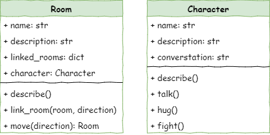

# Stage 3: Character Creation

!!! learn "In this lesson we will learn"
    - how to create a new class and objects with their own attributes
    - how objects of different classes are linked so they can interact
    - how to write methods that control a character's behaviour
    - how to update the main loop so it responds to new commands

<iframe width="560" height="315" src="https://www.youtube-nocookie.com/embed/ufsmJYdUg1Y" title="YouTube video player" frameborder="0" allow="accelerometer; autoplay; clipboard-write; encrypted-media; gyroscope; picture-in-picture; web-share" allowfullscreen></iframe>

## Introduction

Now that the player can move around the dungeon, we need to make it interesting. In this stage we'll fill our dungeon with characters that the player can interact with.

### Pseudocode

```text title="Stage 3 pseudocode"
- Define a Character class
- Create characters
- Add characters to the rooms
- Include characters in the room descriptions
- Create character interactions:
    - talk method
    - hug method
    - fight method
- Add the interactions to the main loop
```

### Class diagram

`Character` is a new class, so it needs a second class diagram.

We also need to add a `character` attribute to the `Room` class, so we can record who is in each room.



## Define the Character class

In Thonny, create a new file and enter the code below. Save it as ***character.py*** in the same folder as ***main.py*** and ***room.py***.

```python linenums="1" hl_lines="1 3 5-9"
--8<-- "examples/stage_3/step01/character.py"
```

??? note "Code explanation"
    - **line 3** → defines a new class called `Character`.
    - **line 5** → defines the dunder init method, which runs every time we make a new `Character` object.
    - **line 7** → stores the character's name in the object.
    - **line 8** → creates a `description` attribute, but leaves it empty (`None`) for now.
    - **line 9** → creates a `conversation` attribute for something the character might say, also empty for now.

## Create characters

Now that we have a `Character` class, we can create `Character` objects in ***main.py***. Add the highlighted code below.

```python linenums="1" hl_lines="4 22-24 26-28"
--8<-- "examples/stage_3/step01b/main.py"
```

!!! primm "PRIMM"
    1. **Predict** what you think will happen. Be specific.
    2. **Run** the program.
    3. Time to **investigate** the code. What does each line do?

??? note "Code explanation"
    - **line 4** → imports the `Character` class from ***character.py*** so we can use it.
    - **line 23** → makes a new `Character` named Ugine and stores it in the variable `ugine`.
    - **line 24** → gives Ugine a description. Ugine has no conversation, so his `conversation` attribute stays `None`.
    - **line 26** → makes a new `Character` named Nigel and stores it in `nigel`.
    - **line 27** → gives Nigel a description.
    - **line 28** → gives Nigel something to say.

## Add characters to the rooms

Now we have two classes that work together: `Room` and `Character`. We need a way to show which character is in which room. In the class diagram, the `Room` class has a new `character` attribute, so each room can store the character inside it.

This is an arbitrary decision. We could just as easily have added an attribute to the `Character` class that stores the room the character is in. Both are valid. The important thing is to be consistent, and to document our decision so others understand it. That's why the class diagram is so important.

### Add a character attribute to the Room class

Return to ***room.py*** and add the highlighted line below.

```python linenums="1" hl_lines="10"
--8<-- "examples/stage_3/step02/room.py"
```

??? note "Code explanation"
    - **line 10** → creates a new attribute called `character` and sets it to `None`, because a new room starts empty.

### Put the characters in the rooms

Then return to ***main.py*** and put characters in our rooms with the highlighted code below.

```python linenums="1" hl_lines="31-33"
--8<-- "examples/stage_3/step03/main.py"
```

!!! primm "PRIMM"
    1. **Predict** what you think will happen. Be specific.
    2. **Run** the program.
    3. Time to **investigate** the code. What does each line do?

??? note "Code explanation"
    - **line 32** → puts the character Ugine in the armoury.
    - **line 33** → puts the character Nigel in the lab.

The program should do nothing new, unless there's an error. That's because we haven't changed the room descriptions to include the characters yet. Let's do that now.

## Include characters in the room description

Adding the characters to the room description takes two steps:

1. Create a `describe` method in the `Character` class.
2. Change the `describe` method in the `Room` class so it calls the character's `describe` method.

### Add a describe method to the Character class

Go to ***character.py*** and add the highlighted code below.

```python linenums="1" hl_lines="11-13"
--8<-- "examples/stage_3/step04/character.py"
```

??? note "Code explanation"
    - **line 11** → defines a `describe` method for characters. The `Room` class already has a `describe` method, but that's fine: they belong to different classes, so `character.describe()` and `room.describe()` are completely separate.
    - **line 13** → prints the character's name and what they look like.

!!! tip "Namespaces"
    Imagine the wardrobe at home. There are different spots for different things: shelves for shirts, drawers for socks, hangers for jackets. When we need something, we go to the right spot and grab it.

    **Namespaces** in programming work the same way. They're like labelled sections that keep code organised. Each class has its own namespace for its attributes and methods, just like each part of the wardrobe stores its own type of clothes.

    That's why `Room` and `Character` can both have a method called `describe` without getting mixed up.

### Change the Room class describe method

Before we change the room's `describe` method, there's a small issue. We have three rooms but only two characters, so the cavern has no character. We don't want the game to describe a character unless one is actually there.

Empty rooms have `character` set to `None`, so we should only describe the character when `character` is not `None`.

Return to ***room.py*** and change the `describe` method as highlighted below.

```python linenums="1" hl_lines="16-17"
--8<-- "examples/stage_3/step05/room.py"
```

!!! primm "PRIMM"
    1. **Predict** what you think will happen. Be specific.
    2. **Run** the program. Check that a character is only described when we enter a room that has one.
    3. Time to **investigate** the code. What does each line do?

??? note "Code explanation"
    - **line 16** → checks whether this room has a character. We use `is not` when comparing with `None`.
    - **line 17** → if there is a character, runs the character's `describe` method to show their details.

## Create character interactions

We want to add three interactions with our characters:

- talk
- hug
- fight

If we look at the class diagram again, the `Character` class has a method for each of these interactions.


### Add new methods to the Character class

Return to ***character.py***. First, let's add the `talk` method with the highlighted code below.

```python linenums="1" hl_lines="15-20"
--8<-- "examples/stage_3/step06/character.py"
```

??? note "Code explanation"
    - **line 15** → defines the `talk` method.
    - **line 17** → checks whether the character has something to say. In ***main.py***, Nigel has a conversation but Ugine doesn't, so the method needs to handle both.
    - **line 18** → if the character has a conversation, prints their name and what they say…
    - **lines 19–20** → …otherwise prints a message saying the character won't talk.

Now let's add both the `hug` and `fight` methods with the highlighted code below.

```python linenums="1" hl_lines="22-24 26-28"
--8<-- "examples/stage_3/step07/character.py"
```

??? note "Code explanation"
    - **line 22** → defines the `hug` method.
    - **line 24** → prints a message using the character's name.
    - **line 26** → defines the `fight` method.
    - **line 28** → prints a message using the character's name.

By now the code for these methods should look familiar. Each one:

- defines the method with `self` as the first argument
- has a comment describing what the method does
- displays a message that uses one of the character's attributes

## Add the interactions to the main loop

Now that characters can respond, we need to add the three commands (`talk`, `hug` and `fight`) to the event handler in the main loop.

Return to ***main.py*** and add the highlighted code.

```python linenums="1" hl_lines="54-68"
--8<-- "examples/stage_3/step08/main.py"
```

!!! primm "PRIMM"
    1. **Predict** what you think will happen. Be specific.
    2. **Run** the program. Try each command in a room with a character, and in the cavern.
    3. Time to **investigate** the code. What does each line do?

??? note "Code explanation"
    - **line 54** → checks whether the player's command was `talk`.
    - **line 55** → checks whether there is a character in the current room. Some rooms (like the cavern) have no character, so we need to allow for this.
    - **line 56** → if there is a character, calls its `talk` method…
    - **lines 57–58** → …otherwise tells the player there's no one to talk to.
    - **lines 59–63** → do the same for the `hug` command, calling the character's `hug` method.
    - **lines 64–68** → do the same for the `fight` command, calling the character's `fight` method.

## Exercises

So far we've used the first four steps of PRIMM. Now it's time to **make**.

### Exercise 1

In Stage 1 we added an extra room. Can you put someone in it? It should:

- create a new character for each extra room, with a description and, if you like, a conversation
- add each new character to its room
