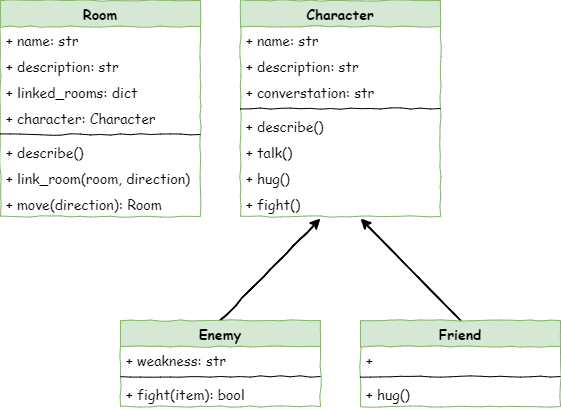
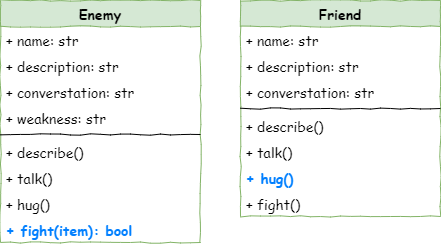

# Stage 4: Character Types

!!! learn "In this lesson we will learn"
    - what inheritance is and how child classes get attributes and methods from a parent class
    - what polymorphism is and how different classes can use the same method in different ways
    - how to refactor code to use child classes without changing its behaviour
    - the three types of programming errors: syntax, runtime and logic errors
    - how to test and troubleshoot code by comparing expected and actual results

!!! terms "Terminology"
    - **child class** – a class based on another class that inherits all of its attributes and methods, also called a subclass or derived class.
    - **inheritance** – the OOP principle of making a new class based on an existing one, so the new class gets the existing class's attributes and methods.
    - **parent class** – the existing class that a child class is based on, also called a superclass or base class.
    - **override** – to replace an inherited method by writing a method with the same name in the child class.
    - **DRY** – short for Don't Repeat Yourself, the rule that we should write code once in one place rather than copying it.
    - **refactoring** – changing how code is written without changing what it does.
    - **polymorphism** – the OOP principle that different classes can have a method with the same name that does different things.
    - **truthy** – describes a value that acts like `True` in an `if` statement, such as a non-empty string, a non-zero number or a list with items in it.
    - **falsy** – describes a value that acts like `False` in an `if` statement, such as `None`, `0`, an empty string or an empty list.
    - **logic error** – a mistake where the program runs without crashing but doesn't do what we meant, so Python gives no warning.
    - **syntax error** – a mistake that breaks the rules of Python, so the program won't run at all.
    - **runtime error** – a mistake that happens while the program is running, when Python tries to do something it can't and crashes with an error message.

<iframe width="560" height="315" src="https://www.youtube-nocookie.com/embed/J8U97_SRx7s" title="YouTube video player" frameborder="0" allow="accelerometer; autoplay; clipboard-write; encrypted-media; gyroscope; picture-in-picture; web-share" allowfullscreen></iframe>

## Introduction

So far we've created a dungeon with several rooms that the player can move between, and filled it with characters the player can interact with. In this stage we'll refine our characters.

### Pseudocode

```text title="Stage 4 pseudocode"
- Define two character types:
    - Friend
    - Enemy
- Change our current characters to one of these types
- Adjust our interactions to allow for the different types
```

### Class diagram

The class diagram now shows two new classes: `Enemy` and `Friend`.



Both classes have arrows pointing to `Character` because they are **child classes**. This means they **inherit** everything the `Character` class has. They can also add new features, or replace methods they inherited.

!!! tip "Inheritance"
    **Inheritance** in OOP means making a new class that is based on an existing one. It's like a family tree: a child class gets traits from its parent class.

    This helps us avoid rewriting the same code, and makes it easier to organise different types of things by what they share and what makes them different.

#### Enemy class

The `Enemy` class:

- inherits the `name`, `description` and `conversation` attributes and the `describe`, `talk` and `hug` methods from the `Character` class
- adds the `weakness` attribute
- **overrides** the `Character` `fight` method with its own `fight` method

#### Friend class

The `Friend` class:

- inherits the `name`, `description` and `conversation` attributes and the `describe`, `talk` and `fight` methods from the `Character` class
- overrides the `Character` `hug` method with its own `hug` method

#### Why use inheritance?

The two child classes end up working like the classes shown in these diagrams.



So why not just make two completely separate classes? Because of the DRY rule: **Don't Repeat Yourself**.

Both classes use the same `describe` method, so it's better to write it once in the `Character` class. Then `Friend` and `Enemy` automatically get it. If we ever change `describe` or `talk`, we only change it in one place, and both child classes get the updated version.

!!! tip "OOP terminology"
    Different books and websites sometimes use different words for the same idea:

    - a **parent class** can also be called a **superclass** or **base class**
    - a **child class** can also be called a **subclass** or **derived class**

## Define the character types

### Create the Friend class

Open ***character.py*** and add the highlighted code below to create the `Friend` class.

```python linenums="1" hl_lines="30 32-34"
--8<-- "examples/stage_4/step01/character.py"
```

??? note "Code explanation"
    - **line 30** → defines a new class called `Friend`. The `(Character)` shows that `Friend` is a child of the `Character` class.
    - **line 32** → defines the dunder init method, which runs whenever we make a new `Friend` object.
    - **line 34** → runs the parent class's `__init__` method first, so a `Friend` gets all the attributes that a `Character` has. `Character` needs a `name`, so we pass the `name` through.

### Create the Enemy class

To create the `Enemy` class, add the highlighted code.

```python linenums="1" hl_lines="36 38-41"
--8<-- "examples/stage_4/step02/character.py"
```

??? note "Code explanation"
    - **line 36** → defines the `Enemy` class as a child of the `Character` class.
    - **line 38** → defines the dunder init method, which runs whenever we make a new `Enemy` object.
    - **line 40** → runs the parent class's `__init__` method, so an `Enemy` gets all the usual character attributes.
    - **line 41** → adds a new `weakness` attribute that every enemy has.

Now that we have two character types, we need to change the characters we've created.

## Change the character types

Return to ***main.py*** and change the highlighted code.

```python linenums="1" hl_lines="4 24 26 28"
--8<-- "examples/stage_4/step03/main.py"
```

??? note "Code explanation"
    - **line 4** → imports the `Friend` and `Enemy` classes instead of `Character`, because we now create characters as one of these types.
    - **line 24** → creates Ugine as an `Enemy`.
    - **line 26** → sets Ugine's weakness, because every enemy has a `weakness` attribute.
    - **line 28** → creates Nigel as a `Friend`.

### Testing the refactor

We've changed *how* the code is written, but not *what* it should do. This is called **refactoring**. Now we need to make sure our changes didn't break anything.

Check that Ugine and Nigel still behave the same as before by filling in this testing table.

| Character | Interaction | Expected result | Actual result |
| :-------- | :---------- | :-------------- | :------------ |
| Ugine | talk | | |
| Ugine | hug | | |
| Ugine | fight | | |
| Nigel | talk | | |
| Nigel | hug | | |
| Nigel | fight | | |

If every expected result matches the actual result, there are no problems. Otherwise, we need to find and fix our mistakes.

## Adjust the interactions

We want the game to react differently depending on the type of character. We shouldn't hug an enemy, and we shouldn't fight a friend. When different classes respond to the same method in different ways, this is called **polymorphism**.

!!! tip "Polymorphism"
    **Polymorphism** in OOP means different classes can have the same method but do different things with it. It's like asking different people to "work": they all do it, but the way they work depends on their job.

    This lets our code treat different objects in the same way, even if they aren't the same type. It makes our programs easier to write, easier to update, and more flexible when things change.

### Adjust the hug method

Right now, the `hug` method comes from the `Character` class, and it always says the character doesn't want to hug us. That's fine for enemies, so we'll leave them. But friends *should* hug us back, so we need to change the `Friend` class.

Return to ***character.py*** and add the highlighted code.

```python linenums="1" hl_lines="36-38"
--8<-- "examples/stage_4/step04/character.py"
```

??? note "Code explanation"
    - **line 36** → defines a `hug` method for the `Friend` class. It has the same name as the one in `Character`, so it overrides the old version for all friends.
    - **line 38** → prints a message using the friend's name.

### Adjust the fight method

Now let's update the `fight` method for the `Enemy` class. The fighting system is simple: every enemy has a **weakness**. If we fight them with their weakness, we win. If we use anything else, we lose.

The highlighted code below creates this mechanic.

```python linenums="1" hl_lines="47-54"
--8<-- "examples/stage_4/step05/character.py"
```

??? note "Code explanation"
    - **line 47** → defines the `fight` method for enemies. `item` is the weapon the player chooses.
    - **line 49** → checks whether the weapon matches the enemy's weakness.
    - **line 50** → if it does, prints a winning message…
    - **line 51** → …and returns `True` to tell ***main.py*** the player won.
    - **lines 52–53** → otherwise prints the losing message…
    - **line 54** → …and returns `False` to tell ***main.py*** the player lost.

Now we need to update the fight section in ***main.py*** so the game uses the new system. Replace that part of the code with the highlighted version below.

```python linenums="1" hl_lines="67-71"
--8<-- "examples/stage_4/step06/main.py"
```

!!! primm "PRIMM"
    1. **Predict** what you think will happen. Be specific.
    2. **Run** the program.
    3. Time to **investigate** the code. What does each line do?

??? note "Code explanation"
    - **line 67** → asks the player which weapon they want to use.
    - **line 68** → calls the character's `fight` method, which prints the fight message and returns `True` for a win or `False` for a loss. We don't need `== True`, because the `if` statement checks whether the value is truthy or falsy.
    - **line 69** → if the player wins, removes the character from the room…
    - **lines 70–71** → …otherwise stops the main loop, which ends the game.

!!! tip "Truthy and falsy values"
    In Python, some values act like `True` and some act like `False` in an `if` statement, even though they aren't `True` or `False`. These are called **truthy** and **falsy** values.

    Truthy values include non-empty strings, non-zero numbers and lists with items in them. Falsy values include `None`, `0`, empty strings, empty lists and `False` itself.

    This matters because when we write something like `if current_room.character:`, Python checks whether that value is truthy (it exists or has content) or falsy (it's empty or `None`), and runs the code based on that.

### Testing

We've changed both the `hug` and `fight` methods, so it's time to test. Again, we'll use a testing table and focus on the code we changed.

| Character | Interaction | Weapon | Expected result | Actual result |
| :-------- | :---------- | :----- | :-------------- | :------------ |
| Ugine | fight | cheese | | |
| Ugine | fight | not cheese | | |
| Ugine | hug | - | | |
| Nigel | fight | - | | |
| Nigel | hug | - | | |

### Friend fight error

Did you get the following error?

``` { .text .error linenums="1" }
Traceback (most recent call last):
  File "C:\deepest_dungeon\main.py", line 68, in <module>
    if current_room.character.fight(weapon):
       ^^^^^^^^^^^^^^^^^^^^^^^^^^^^^^^^^^^^^
TypeError: Character.fight() takes 1 positional argument but 2 were given
```

Why did we get this error? Let's read the error message:

- **line 2** → the error is on line 68 of ***main.py***.
- **line 3** → shows the line of code: `if current_room.character.fight(weapon):`.
- **line 4** → points to the call to `fight` as the problem.
- **line 5** → `fight` only expects one argument (`self`), but it was given two (`self` and `weapon`).

Let's think about this:

1. We have two `fight` methods. Which one caused the problem?
2. Fighting Ugine worked, but fighting Nigel didn't, so it must be the `fight` method that friends use.
3. That method is in ***character.py***, so let's look at it.

```python linenums="1" hl_lines="26 30-38 47"
--8<-- "examples/stage_4/step07/character.py"
```

Looking closely at the code:

- **lines 30–38** → the `Friend` class doesn't have a `fight` method, so it uses the `fight` method it inherits from `Character` on **line 26**.
- **line 26** → the `Character` `fight` method only accepts one argument: `self`.
- **line 47** → the `Enemy` `fight` method accepts two arguments: `self` and `item`.

We've found the problem, but we need to decide what to fix. We changed ***main.py*** so that fighting always uses a weapon, so the simplest fix is to make the `Character` `fight` method accept the extra argument too.

Make the highlighted change to ***character.py***.

```python linenums="1" hl_lines="26"
--8<-- "examples/stage_4/step08/character.py"
```

??? note "Code explanation"
    - **line 26** → adds the `item` argument, so every character's `fight` method can be called with a weapon.

### Test again

Let's run our testing table again.

| Character | Interaction | Weapon | Expected result | Actual result |
| :-------- | :---------- | :----- | :-------------- | :------------ |
| Ugine | fight | cheese | | |
| Ugine | fight | not cheese | | |
| Ugine | hug | - | | |
| Nigel | fight | - | | |
| Nigel | hug | - | | |

There's another problem when we fight Nigel, but this time it's different. There's no error message; the program just stops. This type of mistake is called a **logic error**.

!!! tip "Types of programming errors"
    There are three main types of programming errors:

    - **Syntax errors** happen when we break the rules of Python. The program won't run at all and shows an error straight away.
    - **Runtime errors** happen while the program is running. Python tries to do something it can't, so it crashes and shows an error. The fight error above was one of these.
    - **Logic errors** happen when the program runs without crashing, but doesn't do what we meant. Python won't warn us, so these are the hardest to find.

This is what the game showed right before the program stopped:

```text
You are in the laboratory
A strange odour hangs in a room filled with unknowable contraptions.
Nigel is here, a burly dwarf with golden beads woven through his beard.
To the west is the armoury
> fight
What will you fight with? > dog
Nigel doesn't want to fight you
```

### Troubleshooting a logic error

Fixing logic errors is like being a detective. We follow what the program does step by step to spot where things go wrong.

The problem happens when we fight Nigel, so let's start with the part of the main loop in ***main.py*** that handles the `fight` command.

```python linenums="65" hl_lines="4 7"
--8<-- "examples/stage_4/step06/main.py:65:73"
```

When we fought Nigel:

- We saw the message `Nigel doesn't want to fight you`, so the `fight` method ran on **line 68**.
- Then the game ended, so `running` must have been set to `False`, which happens on **line 71**.
- **Line 71** only runs if the player loses the fight.
- **Line 68** decides whether the player won or lost. It calls the `fight` method and expects a `True` or `False` answer.
- Nigel is a friend, so we need to look at the `fight` method friends use, which is in the `Character` class.

Here's the `fight` method in the `Character` class in ***character.py***:

```python linenums="26"
--8<-- "examples/stage_4/step08/character.py:26:28"
```

Here's the issue: ***main.py*** expects `fight` to return `True` or `False`, but the `Character` `fight` method doesn't return anything.

In Python, a function without a `return` statement still returns something: the value `None`. And `None` is falsy, so the game thinks the player lost the fight and ends the program.

Let's look at the fight handler in ***main.py*** again.

```python linenums="65" hl_lines="4 6-7"
--8<-- "examples/stage_4/step06/main.py:65:73"
```

Looking at **line 68**:

- When we fight Nigel, `current_room.character.fight(weapon)` returns `None`.
- So the line becomes `if None:`, which works the same as `if False:`.
- The program skips the "win" code and goes to the `else` on **line 70**.
- **Line 71** sets `running` to `False`, which ends the game.

Now we know what's happening. To fix it, the `Character` `fight` method needs to return `True`, so line 68 treats it as a win.

Update the method in ***character.py***.

```python linenums="1" hl_lines="29"
--8<-- "examples/stage_4/step09/character.py"
```

!!! primm "PRIMM"
    1. **Predict** what you think will happen. Be specific.
    2. **Run** the program.
    3. Time to **investigate** the code. What does each line do?

??? note "Code explanation"
    - **line 29** → returns `True` when we fight a character that isn't an enemy, so line 71 of ***main.py*** doesn't run and the game keeps going.

### Third time lucky?

Let's make sure the logic error is solved. Complete the testing table again.

| Character | Interaction | Weapon | Expected result | Actual result |
| :-------- | :---------- | :----- | :-------------- | :------------ |
| Ugine | fight | cheese | | |
| Ugine | fight | not cheese | | |
| Ugine | hug | - | | |
| Nigel | fight | - | | |
| Nigel | hug | - | | |

Could you hug Nigel after fighting him? Probably not. The game treated the fight as a win, so it removed Nigel from the room. Friends shouldn't disappear when we "fight" them.

In ***main.py***, change the highlighted code below.

```python linenums="65" hl_lines="5-6"
--8<-- "examples/stage_4/step10/main.py:65:74"
```

!!! primm "PRIMM"
    1. **Predict** what you think will happen. Be specific.
    2. **Run** the program. Check that we can fight Nigel and still hug him afterwards.
    3. Time to **investigate** the code. What does each line do?

??? note "Code explanation"
    - **line 69** → checks whether the character in the room is an `Enemy`. `isinstance` is `True` only when the object was created from the `Enemy` class (or one of its child classes)…
    - **line 70** → …and only then removes the character from the room.

## Exercises

Now it's time to **make**.

### Exercise 1

Can you turn each character you've added into a `Friend` or an `Enemy`? If they're an enemy, don't forget to give them a weakness. Test each one with a testing table.
