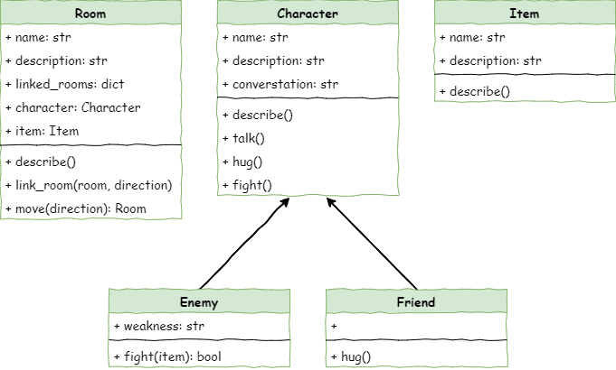

# Stage 5: Item Creation

!!! learn "In this lesson we will learn"
    - how to create a new class with attributes and a method that describes its objects
    - how to create objects from a class and give them values
    - how to link objects of different classes to build a larger system
    - how to update the output so new objects appear when the program runs

<iframe width="560" height="315" src="https://www.youtube-nocookie.com/embed/jYSs_-wY8ys" title="YouTube video player" frameborder="0" allow="accelerometer; autoplay; clipboard-write; encrypted-media; gyroscope; picture-in-picture; web-share" allowfullscreen></iframe>

## Introduction

Our dungeon is starting to look like a real game. We can move between rooms and meet different characters, and each type of character behaves in its own way.

Next, we'll make the dungeon feel more alive by adding items. Most dungeon games let players find and use different objects, so we'll do the same.

### Pseudocode

```text title="Stage 5 pseudocode"
- Make an Item class
- Create item objects
- Put the items into different rooms
- Update the room descriptions so items show up when we enter a room
```

### Class diagram

The class diagram shows our new `Item` class, and the new `item` attribute in the `Room` class.



## Define the Item class

In Thonny, create a new file and enter the code below. Save it as ***item.py*** in the same folder as ***main.py***, ***character.py*** and ***room.py***.

```python linenums="1" hl_lines="1 3 5-8"
--8<-- "examples/stage_5/step01/item.py"
```

Everything in this code should look familiar.

??? note "Code explanation"
    - **line 3** → defines the `Item` class.
    - **line 5** → defines the dunder init method, which runs when we create a new item.
    - **line 7** → stores the item's name, in lower case, in `self.name`.
    - **line 8** → creates the `description` attribute, so we can give the item a description later.

## Create Item objects

To create the `Item` objects, go to ***main.py*** and add the highlighted code below.

```python linenums="1" hl_lines="5 36-38 40-41 43-44"
--8<-- "examples/stage_5/step02/main.py"
```

!!! primm "PRIMM"
    1. **Predict** what you think will happen. Be specific.
    2. **Run** the program.
    3. Time to **investigate** the code. What does each line do?

??? note "Code explanation"
    - **line 5** → imports the `Item` class from ***item.py***.
    - **lines 37–38** → create a cheese `Item` object and give it a description.
    - **lines 40–41** → create a chair `Item` object and give it a description.
    - **lines 43–44** → create an Elmo `Item` object and give it a description.

## Add the items to the rooms

To put items in rooms, we first need to update the `Room` class. Open ***room.py*** and add the highlighted code.

```python linenums="1" hl_lines="11"
--8<-- "examples/stage_5/step03/room.py"
```

??? note "Code explanation"
    - **line 11** → creates the `item` attribute and sets it to `None`, because a new room starts with no item.

Save ***room.py***, then return to ***main.py*** and add the highlighted code.

```python linenums="1" hl_lines="46-49"
--8<-- "examples/stage_5/step04/main.py"
```

!!! primm "PRIMM"
    1. **Predict** what you think will happen. Be specific.
    2. **Run** the program.
    3. Time to **investigate** the code. What does each line do?

??? note "Code explanation"
    - **line 47** → puts the chair in the cavern.
    - **line 48** → puts Elmo in the armoury.
    - **line 49** → puts the cheese in the lab.

## Include the items in the room description

Even with all this new code, the program still looks the same when it runs. That's because we haven't told it to show the items yet. We'll do the same thing we did for characters:

- make a `describe` method in the `Item` class
- make the room's `describe` method call the item's `describe` method

First, go to ***item.py*** and add the highlighted code below.

```python linenums="1" hl_lines="10-12"
--8<-- "examples/stage_5/step05/item.py"
```

??? note "Code explanation"
    - **line 10** → defines the `describe` method for items.
    - **line 12** → prints the item's name and description.

Now go to ***room.py*** and add the highlighted code.

```python linenums="1" hl_lines="19-20"
--8<-- "examples/stage_5/step06/room.py"
```

!!! primm "PRIMM"
    1. **Predict** what you think will happen. Be specific.
    2. **Run** the program.
    3. Time to **investigate** the code. What does each line do?

??? note "Code explanation"
    - **line 19** → checks whether there is an item in the room…
    - **line 20** → …and if there is, calls the item's `describe` method. This works just like the character description on lines 17–18.

Let's test the code by going to each room and checking that the correct item is described.

| Room | Item expected | Item described |
| :--- | :------------ | :------------- |
| Cavern | chair | |
| Armoury | elmo | |
| Lab | cheese | |

## Exercises

Now it's time to **make**.

### Exercise 1

Can you add an item to each room you've added? It should:

- create a new `Item` object with a description for each extra room
- put each new item in its room
- be tested by visiting each room and checking the item is described
