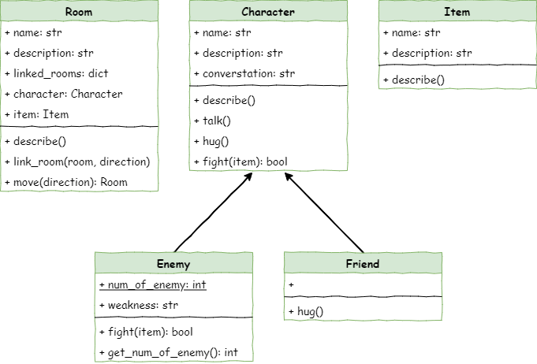

# Stage 7: Victory Conditions

!!! learn "In this lesson we will learn"
    - the difference between class variables and instance variables
    - how objects share information using a class variable
    - how to create and change a class variable
    - where to put `if` statements so the game can check for a win

<iframe width="560" height="315" src="https://www.youtube-nocookie.com/embed/hTGv542obJo" title="YouTube video player" frameborder="0" allow="accelerometer; autoplay; clipboard-write; encrypted-media; gyroscope; picture-in-picture; web-share" allowfullscreen></iframe>

## Introduction

We're almost done with our text-based adventure game. We have a dungeon where the player can move around, pick up items, and talk to or fight different characters. What happens in these interactions depends on the type of character they meet.

In this stage, we'll set up how the player wins the game.

### Pseudocode

```text title="Stage 7 pseudocode"
- Count how many enemies exist
- Lower the count each time an enemy is defeated
- Check when the count reaches zero, so the player wins the game
```

### Class diagram

Have a look at the class diagram for this stage and you'll see something new. The `Enemy` class now has:

- a `num_of_enemy` attribute
- a `get_num_of_enemy` method



The `num_of_enemy` attribute is underlined in the diagram. The underline shows it's a **class variable**. A class variable is shared by every object made from that class. All `Enemy` objects can read it and change it, and when one object changes it, the others see the new value too.

The attributes we've used so far, like `name` and `weakness`, are **instance variables**: each object has its own copy.

In this game, `num_of_enemy` keeps track of how many `Enemy` objects exist, and every enemy shares that same number.

## Count the enemies

To keep track of how many `Enemy` objects are in the game, let's add a class variable to the `Enemy` class.

Open ***character.py*** and add the highlighted code below.

```python linenums="1" hl_lines="43 49"
--8<-- "examples/stage_7/step01/character.py"
```

!!! primm "PRIMM"
    1. **Predict** what you think will happen. Be specific.
    2. **Run** the program to make sure there are no errors.
    3. Time to **investigate** the code. What does each line do?

??? note "Code explanation"
    - **line 43** → creates the class variable `num_of_enemy` and sets it to `0`. It's written inside the class but outside any method, before `__init__`, and doesn't use `self`, because it belongs to the whole class rather than one object.
    - **line 49** → adds 1 to `Enemy.num_of_enemy`. Because `__init__` runs whenever we make a new enemy, the count goes up each time.

We're now counting the enemies, but we can't see the number. Let's create a method that tells us how many enemies are in the dungeon.

Still in ***character.py***, add the highlighted code below.

```python linenums="1" hl_lines="60-61"
--8<-- "examples/stage_7/step02/character.py"
```

??? note "Code explanation"
    - **line 60** → defines the `get_num_of_enemy` method. It doesn't have `self`, because it isn't about one object; it works for the whole class.
    - **line 61** → returns the current number of enemies. `Enemy.` tells Python to use the class variable from the `Enemy` class.

!!! tip "Calling a method without self"
    Because `get_num_of_enemy` has no `self`, we call it on the class, like `Enemy.get_num_of_enemy()`, not on an object like `ugine`.

## Reduce the enemy count

We can now count the enemies, but we also need to **lower** the count when the player beats one.

The `fight` method in the `Enemy` class already runs code when an enemy is defeated, so we just need to add one line there. Stay in ***character.py*** and add the highlighted line below.

```python linenums="1" hl_lines="55"
--8<-- "examples/stage_7/step03/character.py"
```

??? note "Code explanation"
    - **line 55** → lowers the class variable by one. It's inside the `if` on line 53, so it only runs when the player wins the fight.

## Check for victory

The player wins when every enemy has been defeated. When that happens, the enemy count will be `0`. We need to choose the right spot in the code to check for this.

In ***main.py***, line 89 is where the game already checks whether the player won a fight, so that's the best place to add our check.

Add the highlighted code below.

```python linenums="1" hl_lines="92-94"
--8<-- "examples/stage_7/step04/main.py"
```

!!! primm "PRIMM"
    1. **Predict** what you think will happen. Be specific.
    2. **Run** the program. Make sure the player wins when they have defeated all the enemies.
    3. Time to **investigate** the code. What does each line do?

??? note "Code explanation"
    - **line 92** → checks whether the enemy count has reached `0`. It's inside the `if` statements on lines 89 and 90, so it only runs after the player defeats an enemy.
    - **line 93** → shows the winning message.
    - **line 94** → stops the main loop, so the game ends.

## Exercises

Our code now works, so it's time to reflect on what we've built.

### Exercise 1

Can you explain how the game knows when the player has won? Read over your code and be ready to explain to your teacher, in your own words:

- what a class variable is, and why `num_of_enemy` needs to be one
- which lines change the enemy count, and when they run
- where the game checks for a win, and why it's checked there
