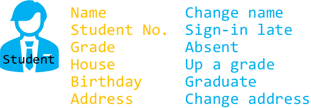
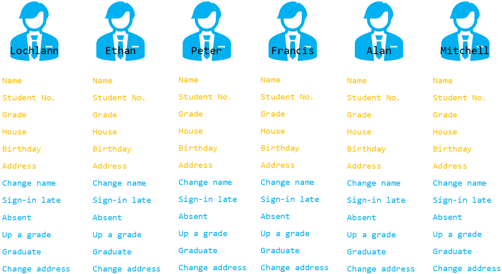
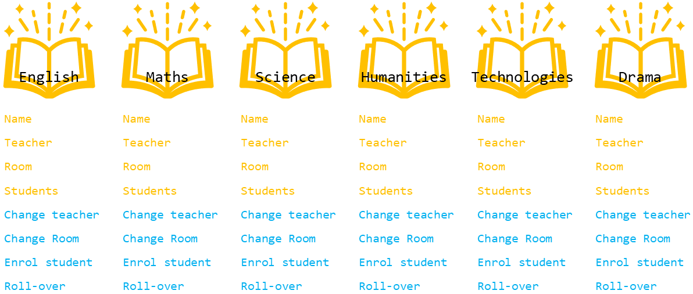
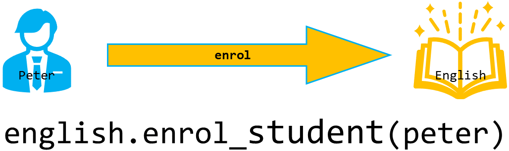

# OOP Primer

!!! learn "On this page we will learn"
    - that OOP is a way of organising programs using objects
    - what the terms class, object, attribute and method mean
    - the difference between a class and an object
    - how objects interact using methods
    - how encapsulation and abstraction appear in simple Python code

This course teaches us to use **object-oriented programming** (OOP) in Python. Before we start building, we need to cover some of the basic ideas we'll meet along the way.

## What is OOP?

OOP is a way of programming where we organise our code around **objects**. An object is like a digital version of a real thing.

In OOP, different objects work together. A simple way to understand this is to use a real-life example: imagine we want to create digital versions of **students** and the **subjects** they take.

## What is an object?

The first "thing" in our example is a student. In OOP, the description of a kind of thing is called a **class**. So we would create a student class, and every student in our program would be made from that class.

Let's use this image to represent our student class:


All students share certain qualities. In OOP, these qualities are called **attributes**. Students also do similar actions. These actions are called **methods**.

Below is our student class with its attributes (yellow) and methods (blue). We can think of a class as a blueprint. Every student object made from this blueprint has the same attributes and methods.



Once we have the student class, we can create actual students in our program. These are called **objects** (or **instances** of the class). Each object gets its attributes and methods from the class.



## How does an object-oriented program work?

An object-oriented program works by changing objects through their methods. For example, a student object might have a method called `change_name`, which updates the student's name.

Objects can also work with each other. To show this, imagine we also have subject objects in the program.



If we want to enrol a student in a subject, we call the subject's `enrol_student` method. For example, the English subject object can use its method to enrol Peter.



## Encapsulation and abstraction

Look at the code shown under the last diagram. That's what this idea looks like in Python. It looks similar to code we've already used with turtle, like `my_ttl.forward(10)`. That's because Python is an object-oriented language.

```python linenums="1"
--8<-- "examples/start/oop_primer/main.py"
```

!!! primm "PRIMM"
    1. **Predict** what you think will happen. Be specific.
    2. **Run** the program.
    3. Time to **investigate** the code. What does each line do?

??? note "Code explanation"
    - **line 1** → imports the `turtle` module, which contains the `Turtle` class.
    - **line 3** → creates a new turtle object from the `Turtle` class and stores it in `my_ttl`.
    - **line 5** → calls the turtle's `forward` method, which moves this turtle 100 steps.

All the time we've been programming in Python we've been using an object-oriented language; we just didn't know it. This example shows two of the main principles of OOP: **encapsulation** and **abstraction**.

**Encapsulation** means the important data is stored inside the object, and we get to that data through the object's methods. For example, the turtle has an `x` position, and we read it using `xcor()`.

**Abstraction** means the complicated code inside the object is hidden from us. We don't see how the turtle moves; we just call `forward(100)` and it works.

## Other OOP principles

OOP has two more important ideas: **inheritance** and **polymorphism**. We'll learn about these in [Stage 4](../stages/stage_4.md).
