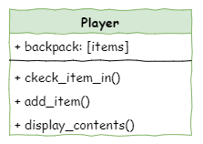

# Extension - Player Class

```{topic} In this lesson you will:
- learn how to refactor code by consolodating existing code into a new class.
```

In this extensions tutorial, we will refactor our code to create a Player class. This will give the game a player object which we can use to add features associated with the player (health, inventory, gear, weapons etc.). The first feature we will add is the player inventory, known in our game as the backpack.

## Class Diagram

Currently the code dealing with the backpack is held in `main.py`. Before we plan our new class, we need to look at this code an identify all relevant feature we need to incorporate. So let's look at the `main.py` from the end of the standard tutorials.

```{code-block} python
:linenos:
:emphasize-lines: 54, 82-85, 101-106, 109-114
# main.py

from room import Room
from character import Enemy, Friend
from item import Item

# create rooms
cavern = Room("Cavern")
cavern.description = ("A room so big that the light of your torch doesn’t reach the walls.")

armoury = Room("Armoury")
armoury.description = ("The walls are lined with racks that once held weapons and armour.")

lab = Room("Laboratory")
lab.description = ("A strange odour hangs in a room filled with unknownable contraptions.")

# link rooms
cavern.link_rooms(armoury,"south")
armoury.link_rooms(cavern,"north")
armoury.link_rooms(lab,"east")
lab.link_rooms(armoury,"west")

# create characters
ugine = Enemy("Ugine")
ugine.description = "a huge troll with rotting teeth."
ugine.weakness = "cheese"

nigel = Friend("Nigel")
nigel.description = "a burly dwarf with golden bead in woven through his beard."
nigel.conversation = "Well youngan, what are you doing here?"

# add characters to rooms
armoury.character = ugine
lab.character = nigel

# create items
cheese = Item("Cheese")
cheese.description = "super smelly"

chair = Item("Chair")
chair.description = "designed to be sat on"

elmo = Item("Elmo")
elmo.description = "wanting to be tickled"

# add items to rooms
cavern.item = chair
armoury.item = elmo
lab.item = cheese

# initialise variables
running = True
current_room = cavern
backpack = []

# ----- MAIN LOOP -----
while running:
    current_room.describe()
    
    command = input("> ").lower()
    
    # move
    if command in ["north", "south", "east", "west"]:
        current_room = current_room.move(command)
        print(f"You travel {command}")
    # talk
    elif command == "talk":
        if current_room.character is not None:
            current_room.character.talk()
        else:
            print("There is no one here to talk to")
    # hug
    elif command == "hug":
        if current_room.character is not None:
            current_room.character.hug()
        else:
            print("There is no one here to hug")
    # fight
    elif command== "fight":
        if current_room.character is not None:
            weapon = input("What will you fight with? > ").lower()
            available_weapons = []
            for item in backpack:
                available_weapons.append(item.name)
            if weapon in available_weapons:
                if current_room.character.fight(weapon):
                    current_room.character = None
                    if Enemy.num_of_enemy == 0:
                        print("You have slain the enemy. You are victorious!")
                        running = False
                else:
                    running = False
            else:
                print(f"You don't have {weapon}")
                print(f"{current_room.character.name} strikes you down.")
                running = False
        else:
            print("There is no one here to fight")
    # take
    elif command == "take":
        if current_room.item is not None:
            backpack.append(current_room.item)
            print(f"You put {current_room.item.name} into your backpack")
            current_room.item = None
        else:
            print("There is nothing here to take")
    # backpack
    elif command == "backpack":
        if backpack == []:
            print("It is empty")
        else:
            print("You have:")
            for item in backpack:
                print(f"- {item.name.capitalize()}")
    # help
    elif command == "help":
        print("Type which direction you wish to move,")
        print("or use one of these commands:")
        print("- Talk")
        print("- Fight")
        print("- Hug")
        print("- Take")
        print("- Backpack")
    # quit
    elif command == "quit":
        running = False
    # incorrect command
    else:
        print("Enter 'help' for list of commands")
    input("\nPress <Enter> to continue")
    
print("Thank you for playing Darkest Dungeon")
```

You will notice that there are four places that `main.py` interacts with the player's backpack.

- **line 54** &rarr; defines the backpack variable as an empty list
- **lines 82 - 85** &rarr; checks if chosen weapon is in the backpack
- **lines 101 - 106** &rarr; adds item to backpack
- **lines 109-114** &rarr; displays the contents of the backpack

If we were to move these features to a Player class, we need to consider the nature of the four features:

- the backpack describes part of the player &rarr; attribute
- checking for weapon in backpack is an action &rarr; method
- adding an item to backpack is an action &rarr; method
- displaying the contents of the backpack is an actions &rarr; method

Therefore the class diagram would look like this:



Now that we have a plan. Lets implement it in our code.