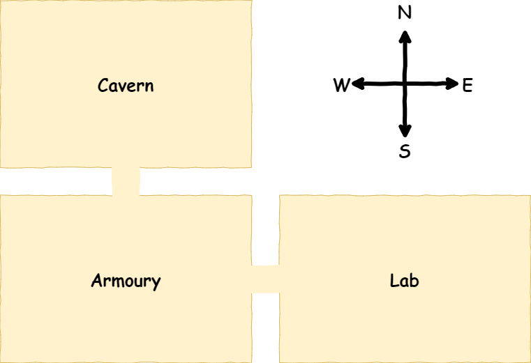
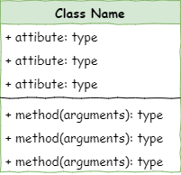

# Lesson 1 - Create Rooms

```{topic} In this lesson you will:

- Learn about the object orientated programming concepts of objects, classes, attributes and methods.
- Create three rooms
- Link the rooms together
```

<iframe width="560" height="315" src="https://www.youtube-nocookie.com/embed/GeSTPYPPEfU" title="YouTube video player" frameborder="0" allow="accelerometer; autoplay; clipboard-write; encrypted-media; gyroscope; picture-in-picture; web-share" allowfullscreen></iframe>

## Introduction

In this lesson we will create three rooms and link those rooms together. Below is a rough map of our dungeon.



To achieve this we will need to create two files:

- `main.py` &rarr; runs the program
- `room.py` &rarr; stores information about the `Room` class

In those two files we will complete the following steps:

1. Define the `Room` class
2. Create `Room` objects
3. Describe `Room` objects
4. Link the `Room` objects
5. Include the linked `Rooms` in the description of each `Room` object

## Class diagrams

We will be using Universal Modelling Language (UML) class diagrams to show the different classes of our program and how they work together.

In UML, classes are represented by the three row table.



- The class name goes in row 1
- All the class attributes go in row 2, along with their datatype
- The class methods are shown in row 3, along with the arguments and datatype of any returned value

The case diagram for the `Room` class is as follows:


From the diagram we can tell:

- The class name is `Room`
- The attributes are:
  - `name` which is a string datatype
  - `description` which is a string datatype
  - `linked_rooms` which is a dictionary
- The methods are:
  - `describe` which takes no arguments and returns no values
  - `link_room` which returns nothing and takes two arguments:
    - `room`
    - `direction`

## Define the Room class

Open up Thonny and, if needed, create a new file.

Then type the code below into the new file

```{code-block} python
:linenos:
:emphasize-lines: 1,3
# room.py

class Room():
```

Lets unpack the code:

- `# room.py` - is a simple comment containing the file name. Since this program involves multiple files, this is a simple way to keep track of which file you are currently working on.
- `class Room():` - defined the `Room` class object

```{admonition} Naming conventions
In most cases, Pythons naming conventions call for names to be written in `snake_case`, but class names are an exception to this rule. Class names should use `CamelCase`, like `Room` in our code.

Since this is a convention, and won't raise an error if not follow it. This is about maintainabilty and ensuring your code is easy to follow.

Also note that our file name is not capitalised. This is import for when we import our class.
```

### Dunder init method

All Python classes have a special method called the dunder init. The actual method name is `__init__`, which is double-underscore init double underscore, hence the name dunder init.

The dunder init is a method that is automatically called whenever an object of the class is created. It is used to initialize the attributes of the object. It can also be used to perform any other setup that the object needs before it is used, including calling other methods.

Let's create our dunder init for our `Room` class by adding the highlighted code below.

```{code-block} python
:linenos:
:emphasize-lines: 5-6, 8-9
# room.py

class Room():

    def __init__(self, room_name):
        # intialise the room object

        self.name = room_name.lower()
        self.description = None
```

Breaking that code down:

- `def __init__(self, room_name):` - defines the dunder init method
  - `self` is always the first argument in class methods.
    - Since classes can be used to create many instances of the object, `self` tells Python that you are referring to this instance of the object.
    - For example, when we create the cavern room object, `self` will be referring to the cavern room.
    - When narrating the code, I find it useful to substitute `self` with **this object**.
  - `room_name` is a string containing the name of the room, that needs to be passed when the `Room` object is made.
- `# intialise the room object` - is a comment that explains what the method does. Explaining your methods is another way of increasing the readability of your code and enhances it's maintainability.
- `self.name = room_name.lower()` - assigns the value passed in the `room_name` argument to the object's attribute room_name
  - `self.name` - using my substitution trick, this means "This object's name", or "This room's name"
  - `room_name.lower()` coverts the string passed in the argument to all lower case before assigning it to `self.name`
- `self.description = None` creates the objects description attribute and assigns `None` to it.
  - `self.description` - using my substitution trick, this means "This object's description" or "This room's description"
  - it is best practice to define all the class attributes in `__init__`
  - when the attribute value is added after the object has been created, assign the value of `None` to the attribute in the `__init__`

### Save room.py

```{admonition} Saving files
:class: warning
Since this program will be using multiple files, the location they are saved is important. 

The **main.py** file will be importing classes from the your other files. The first place it will look is within the local directory (ie. the folder it is saved in).

To minimise potential problems, you need to create a new folder for these tutorials.

It is also important to ensure you file names are correct, inlcuding the capilatisation and the **.py** extension.
```

Make a folder called **deepest_dungeon**. Calling your **room.py** save it in your **deepest_dungeon** folder.

## Create Room objects

Create a new file. Save it as **main.py** in your **deepest_dungeon** folder. This file is going to control our game.

Then type to following code into the **main.py*

```{code-block} python
:linenos:
:emphasize-lines: 1, 3, 5-6, 8, 10, 12
# main.py

from room import Room

# create rooms
cavern = Room("Cavern")

armoury = Room("Armoury")

lab = Room("Laboratory")

print(cavern.name)
```

We're going to run our program for the first time, but before let's introduce the PRIMM concept.

```{admonition} PRIMM
Throughout this course we will use the **PRIMM** process to reinforce our learning. **PRIMM** stands for **Predict**, **Run**, **Investigate**, **Modify**, and **Make**. It reflects effective programming practices and encourages curiosity in programming.

**Predict**: Before you run the code you need to predict what you think will happen. Go ahead and have a guess at what you think will happen.

**Run**: Then run the program and see how accurate your prediction was. If your prediction was incorrect, how was the result different?

**Investigate**: Go through the code and work out what each line of code does.

**Modify**: Edit the code. Change it around and see that results your get

**Make**: Use your new understanding of the code to make a different program.
```

Lets run through the **PRIMM** process now

**Predict** in detail what you think the program will do, then **run** the program.

Let's **investigate** the code, by breaking it down line-by-line.

- `# main.py` - a simple comment which helps identify which file you are currently working in.
- `from room import Room` this is a familiar import statement, but this time we are importing our own module
  - `Room` - refers to the `Room` class that we just made
  - `room` - refers to the Python file which contains the `Room` class, in our case `room.py`
  - this line effectively says: **from `room.py` import the `Room` class**
  - note the capitalisation - by using snake case for our file name and camel case for our class name, we can distinguish between the two.
- `# create rooms` - a comment to help structure the code.
  - `main.py` will become quite long. Structuring the code with comments will improve its readability.
- `cavern = Room("Cavern")` - this instantiated (creates) our first `Room` object
  - `Room("Cavern")` - creates a `Room` object
    - when we create a `Room` object the `__init__` automatically runs
    - the `__init__` requires a single argument to be passed, we pass `"Cavern"`
    - the `__init__` then takes the `"Cavern"` string and assigns it to the `name` attribute of this object
  - `cavern =` assigns our newly created `Room` object to the variable `cavern`
- `armoury = Room("Armoury")` - creates a different `Room` object
  - `"Armoury"` is passed to the `name` attribute
  - this object is assigned to `armoury`
- `lab = Room("Laboratory")` - creates a third `Room` object
  - `"Laboratory"` is passed to the `name` attribute
  - this object is assigned to `lab`
- `print(cavern.name)` - prints the name of the `cavern` `Room` object
  - `cavern.name` - get the value stored in the `name` attribute of the `cavern` `Room` object
  - `print` - print that value to the terminal

**Modify** the code so that it prints the names of the other two `Room` objects.

## Describe Room objects

If we look at the `Room` class we will notice that there is a `description` attribute which currently stores `None`.

```{code-block} python
:linenos:
:emphasize-lines: 9
# room.py

class Room():

    def __init__(self, room_name):
        # intialise the room object

        self.name = room_name.lower()
        self.description = None
```

We want our `Room` objects to have descriptions, so let's assign some values to them.

```{code-block} python
:linenos:
:emphasize-lines: 7, 10, 13, 16
# main.py

from room import Room

# create rooms
cavern = Room("Cavern")
cavern.description = "A room so big that the light of your torch doesn’t reach the walls."

armoury = Room("Armoury")
armoury.description = "The walls are lined with racks that once held weapons and armour."

lab = Room("Laboratory")
lab.description = "A strange odour hangs in a room filled with unknownable contraptions."

print(cavern.name)
print(cavern.description)
```

**Predict** in detail what you think the program will do, then **run** the program.

Let's **investigate** the new code line-by-line.

- `cavern.description = "A room so big that the light of your torch doesn’t reach the walls."`
  - directly accesses the `description` attribute for the `cavern` `Room` object
  - assigns the string to the `description` attribute of the `cavern` `Room` object
- `armoury.description = "The walls are lined with racks that once held weapons and armour."`
  - assigns the string to the `description` attribute of the `armoury` `Room` object
- `lab.description = "A strange odour hangs in a room filled with unknownable contraptions."`
  - assigns the string to the `description` attribute of the `lab` `Room` object
- `print(cavern.description)`
  - accesses the value stored in the `description` attribute of the `cavern` `Room` object
  - prints that value to the terminal

**Modify** the code so that it prints the descriptions of the other two `Room` objects.

### Describe method

It is good programming practice to not directly access an object's attributes. You will notice that in our UML Class Diagram the `Room` class has a `describe()` method.


Creating methods is a better way of accessing object's attributes. So let's add the `describe()` to our code.

Go back to the **room.py** file and add the highlighted code below.

```{code-block} python
:linenos:
:emphasize-lines: 10-13
# room.py

class Room():
    
    def __init__(self,room_name):
        # initialises the room object
        self.name = room_name.lower()
        self.description = None
        
    def describe(self):
        # displays a description of the room in the UI
        print(f"\nYou are in the {self.name}")
        print(self.description)
```

Then go back to **main.py** and replace lines 15 and 16 with the highlighted code below.

```{code-block} python
:linenos:
:emphasize-lines: 15-18
# main.py

from room import Room

# create rooms
cavern = Room("Cavern")
cavern.description = "A room so big that the light of your torch doesn’t reach the walls."

armoury = Room("Armoury")
armoury.description = "The walls are lined with racks that once held weapons and armour."

lab = Room("Laboratory")
lab.description = "A strange odour hangs in a room filled with unknownable contraptions."

# describe rooms
cavern.describe()
armoury.describe()
lab.describe()
```

**Predict** in detail what you think the program will do, then **run** the program.

Let's **investigate** the *new* code line-by-line. First the code in **room.py**:

- `def describe(self):` - defines the `describe` method
  - `def` - methods are functions that exist within a class, therefore the `def` keyword is used to define methods.
  - `describe` - this is the name of our method
  - `(self)` - `self` is the first argument for all methods. Just like with the `__init__` method, `self` can be red as "this object"
  - `:` indicates a following indented code block.
  - take note of the level of indentation. All class methods need to be indented one level (same as the `__init__` method)
- `# displays a description of the room in the UI` - explains what the method does
  - this is good coding practice and improves the readability of your code
- `print(f"\nYou are in the {self.name}")` 
  - takes the `name` attributes and inserts it into an f-string
  - prints the f-string to the terminal
  - again, using the `self` substitution, `self.name` should read as **this room's name**
- `print(self.description)` - prints to terminal the value stored in the `description` attribute

Now the code in **main.py**

- `# describe rooms` - another code structure comment
- `cavern.describe()` - run the `describe` method for the `cavern` `Room` object
- `armoury.describe()` - run the `describe` method for the `armoury` `Room` object
- `lab.describe()` - run the `describe` method for the `lab` `Room` object

## Link rooms

If you look at our map you will notice that the rooms are linked, so that our adventure can move between them.

- Cavern &darr; Armoury
- Armoury &uarr; Cavern
- Armoury &rarr; Lab
- Lab &larr; Armoury


Our class diagram shows we use an attribute (`linked_rooms`) and a method (`link_room(room, direction)`) to model this.


How will this work?

The `linked_rooms` is a dictionary, so it stores key:value pairs. The key will be the direction (north, south, east or west), and the value will be the `Room` `object` that is in that direction. For example, the `linked_rooms` dictionary for the Armoury would be:

```{code-block} python
:linenos:
{
  "north" : cavern,
  "east" : lab
}
```

The `link_room` method will take two arguments (`room` and `direction`) and add that key value pair to the `linked_rooms` attribute.

So lets implement this. First go back to **room.py**, and add the code highlighted below

```{code-block} python
:linenos:
:emphasize-lines: 9, 16-18
# room.py

class Room():
    
    def __init__(self,room_name):
        # initialises the room object
        self.name = room_name.lower()
        self.description = None
        self.linked_rooms = {}
        
    def describe(self):
        # displays a description of the room in the UI
        print(f"\nYou are in the {self.name}")
        print(self.description)
    
    def link_rooms(self, room_to_link, direction):
        # links the provided room, in the provided direction
        self.linked_rooms[direction.lower()] = room_to_link
```

Then open the **main.py** and add the code highlighted below:

```{code-block} python
:linenos:
:emphasize-lines: 15-19
# main.py

from room import Room

# create rooms
cavern = Room("Cavern")
cavern.description = "A room so big that the light of your torch doesn’t reach the walls."

armoury = Room("Armoury")
armoury.description = "The walls are lined with racks that once held weapons and armour."

lab = Room("Laboratory")
lab.description = "A strange odour hangs in a room filled with unknownable contraptions."

# link rooms
cavern.link_rooms(armoury,"south")
armoury.link_rooms(cavern,"north")
armoury.link_rooms(lab,"east")
lab.link_rooms(armoury,"west")

# describe the rooms
cavern.describe()
armoury.describe()
lab.describe()
```

**Predict** in detail what you think the program will do, then **run** the program.

Did you predict that nothing would change? We'll fix that later. In the meanwhile, let's **investigate** the *new* code line-by-line. 

First the code in **room.py**:

- `self.linked_rooms = {}` - creates an empty dictionary for the `linked_rooms` attribute
- `def link_rooms(self, room_to_link, direction):` - defines the `link_rooms` method with three arguments
  - `self` - the first argument for all class methods is always `self`, which refers to *this object*
  - `room_to_link` the `Room` object that you will be linking to
  - `direction` the values of `north`, `south`, `east` or `west` which will be the key for in the dictionary
- `# links the provided room, in the provided direction` - comment explaining what the method does
- `self.linked_rooms[direction.lower()] = room_to_link` - adds a new value to the `linked_rooms` attribute
  - `direction.lower()` - takes the `direction` argument and makes it all lower case
  - `self.linked_rooms[direction.lower()]` - checks the `linked_room` dictionary for the `direction` key
  - `= room_to_link` 
    - if the `direction` key doesn't exists, adds a key:value pair of `direction`:`room_to_link`
    - if the `direction` key exists, changes the current value to `room_to_link`
  
Then in **main.py**:

- `# link rooms` - code structuring comment
- `cavern.link_rooms(armoury,"south")` - links the `cavern` and the `armoury` to the `"south"` of it.
- `armoury.link_rooms(cavern,"north")` - links the `armoury` and the `cavern` to the `"north"` of it.
- `armoury.link_rooms(lab,"east")` - links the `armoury` and the `lab` to the `"east"` of it.
- `lab.link_rooms(armoury,"west")` - links the `lab` and the `armoury` to the `"west"` of it.

Notice that each connection needs two calls to the `link_rooms` method.

## Include linked Rooms in description

Remember how running the last lot of code didn't change anything? Well, it did actually change things. All the rooms were linked together. We just didn't display that information. So let's address that by adding these connections to our description.

Go to your **room.py** file and include the highlighted code below.

```{code-block} python
:linenos:
:emphasize-lines: 15-16
# room.py

class Room():
    
    def __init__(self,room_name):
        # initialises the room object
        self.name = room_name.lower()
        self.description = None
        self.linked_rooms = {}
        
    def describe(self):
        # displays a description of the room in the UI
        print(f"\nYou are in the {self.name}")
        print(self.description)
        for direction in self.linked_rooms:
            print(f"To the {direction} is the {self.linked_rooms[direction].name}")
    
    def link_rooms(self, room_to_link, direction):
        # links the provided room, in the provided direction
        self.linked_rooms[direction.lower()] = room_to_link
```

**Predict** in detail what you think the program will do, then **run** the program.

Let's **investigate** the *new* code line-by-line.

- `for direction in self.linked_rooms:` - iterates over each key:value pair in the `linked_rooms` attribute
  - in Python, dictionaries are iterable collections (like lists), so you can use `for` loops to iterate over them
  - in this example `direction` will be each key value in the dictionary
- `print(f"To the {direction} is the {self.linked_rooms[direction].name}")` prints the linked rooms to the terminal
  - `direction` is the current key (`"north"`, `"south"`, `"east"` or `"west"`)
  - `self.linked_rooms[direction].name` is the name of the `Room` object that is linked in the current direction.

## Lesson 1 task

During this lesson we have only been focusing on the first four stages of the PRIMM model. Now it is time for your to implement the **Make** phase.

Taking the knowledge your have gained through this lesson, you need to:

- create one, or more additional rooms
- link those additional rooms to one or more of your other rooms.