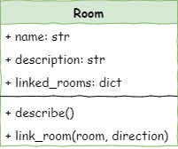

# Lesson 1 - Create Rooms

```{topic} In this lesson you will:

- Learn about the object orientated programming concepts of objects, classes, attributes and methods.
- Create three rooms
- Link the rooms together
```

<iframe width="560" height="315" src="https://www.youtube-nocookie.com/embed/GeSTPYPPEfU" title="YouTube video player" frameborder="0" allow="accelerometer; autoplay; clipboard-write; encrypted-media; gyroscope; picture-in-picture; web-share" allowfullscreen></iframe>

## Introduction

In this lesson we will create three rooms and link those rooms together. Below is a rough map of our dungeon.


To achieve this we will need to create two files:

- `main.py` &rarr; runs the program
- `room.py` &rarr; stores information about the `Room` class

In those two files we will complete the following steps:

1. Define the `Room` class
2. Create `Room` objects
3. Describe `Room` objects
4. Link the `Room` objects
5. Included the linked `Rooms` in the description of each `Room` object

## Class diagrams

We will be using Universal Modelling Language (UML) class diagrams to show the different classes of our program and how they work together.

In UML, classes are represented by the three row table.


- The class name goes in row 1
- All the class attributes go in row 2, along with their datatype
- The class methods are shown in row 3, along with the arguments and datatype of any returned value

The case diagram for the `Room` class is as follows:



From the diagram we can tell:

- The class name is `Room`
- The attributes are:
  - `name` which is a string datatype
  - `description` which is a string datatype
  - `linked_rooms` which is a dictionary
- The methods are:
  - `describe` which takes no arguments and returns no values
  - `link_room` which returns nothing and takes two arguments:
    - `room`
    - `direction`

## Step 1: Define the Room class

Open up Thonny and, if needed, create a new file.

Then type the code below into the new file

```{code-block} python
:linenos:
:emphasize-lines: 1,3
# room.py

class Room():
```

Lets unpack the code:

- `# room.py` - is a simple comment containing the file name. Since this program involves multiple files, this is a simple way to keep track of which file you are currently working on.
- `class Room():` - defined the `Room` class object

```{admonition} Naming conventions
In most cases, Pythons naming conventions call for names to be written in `snake_case`, but class names are an exception to this rule. Class names should be capitalised, like `Room` in our code.

Since this is a convention, and won't raise an error if not follow it. This is about maintainabilty and ensuring your code is easy to follow.

Also note that our file name is not capitalised. This is import for when we import our class.
```

### Dunder init method

All Python classes have a special method called the dunder init. The actual method name is `__init__`, which is double-underscore init double underscore, hence the name dunder init.

The dunder init is a method that is automatically called whenever an object of the class is created. It is used to initialize the attributes of the object. It can also be used to perform any other setup that the object needs before it is used, including calling other methods.

Let's create our dunder init for our `Room` class by adding the highlighted code below.

```{code-block} python
:linenos:
:emphasize-lines: 5-6, 8-9
# room.py

class Room():

    def __init__(self, room_name):
        # intialise the room object

        self.name = room_name.lower()
        self.description = None
```

Breaking that code down:

- `def __init__(self, room_name):` - defines the dunder init method
  - `self` is always the first argument in class methods.
    - Since classes can be used to create many instances of the object, `self` tells Python that you are referring to this instance of the object.
    - For example, when we create the cavern room object, `self` will be referring to the cavern room.
    - When narrating the code, I find it useful to substitute `self` with **this object**.
  - `room_name` is a string containing the name of the room, that needs to be passed when the `Room` object is made.
- `# intialise the room object` - is a comment that explains what the method does. Explaining your methods is another way of increasing the readability of your code and enhances it's maintainability.
- `self.name = room_name.lower()` - assigns the value passed in the `room_name` argument to the object's attribute room_name
  - `self.name` - using my substitution trick, this means "This object's name", or "This room's name"
  - `room_name.lower()` coverts the string passed in the argument to all lower case before assigning it to `self.name`
- `self.description = None` creates the objects description attribute and assigns `None` to it.
  - `self.description` - using my substitution trick, this means "This object's description" or "This room's description"
  - it is best practice to define all the class attributes in `__init__`
  - when the attribute value is added after the object has been created, assign the value of `None` to the attribute in the `__init__`

### Save room.py

```{admonition} Saving files
:class: warning
Since this program will be using multiple files, the location they are saved is important. 

The **main.py** file will be importing classes from the your other files. The first place it will look is within the local directory (ie. the folder it is saved in).

To minimise potential problems, you need to create a new folder for these tutorials.

It is also important to ensure you file names are correct, inlcuding the capilatisation and the **.py** extension.
```

Make a folder called **deepest_dungeon**. Calling your **room.py** save it in your **deepest_dungeon** folder.

