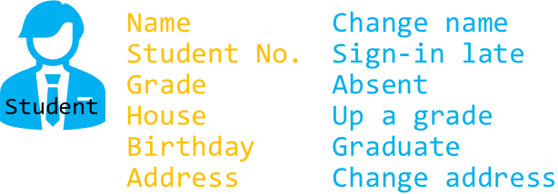
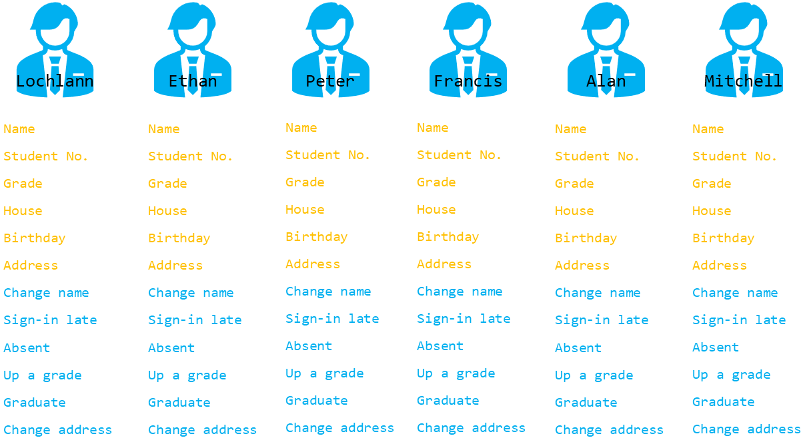
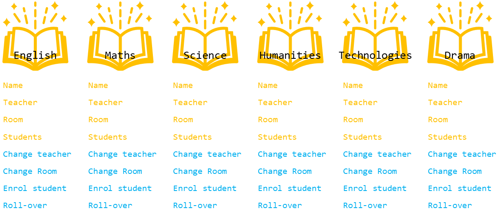
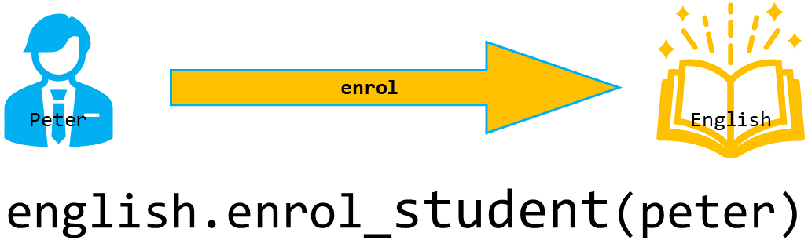

# OOP Primer

```{topic} Learning Intentions
By the end of this lesson, you will be able to:
* understand that OOP is a way of organising programs using objects
* identify the terms class, object, attribute, and method
* explain the difference between a class and an object
* describe how objects interact using methods
* recognise encapsulation and abstraction in simple Python examples
```

This course will teach you about using Object orientated programming (OOP) in Python. Before we explore using OOP in Python, we need to cover some of the basic concepts you will encounter during the course.

## What is OOP?

OOP is a way of programming where you organise your code around **objects**. An object is like a digital version of a real thing.

In OOP, different objects can work together. A simple way to understand this is to use a real-life example: imagine you want to create digital versions of **students** and the **subjects** they take.

## What is an object?

The first “thing” in our example is a student. In OOP, these “things” are called classes.
So you would create a student class, and every student in your program would be made from that class.

Let's use this image to represent our student class:


All students share certain qualities. In OOP, these qualities are called attributes.
Students also do similar actions. These actions are called methods.

So below is our student **class** with their respective **attributes** (yellow) and **methods** (blue). You can think of a class as a blueprint. Every student object made from this blueprint will have the same attributes and methods.



Once you have the student class, you can create actual students in your program. These are called objects (or instances of the class). Each object gets all its attributes and methods from the class.



## How does an Object Orientated Program work?

A program that uses OOP works by making changes to objects through their methods. For example, a student object might have a method called **change_name**, which updates the student’s name.

Objects can also work with each other. To show this, imagine we also have subject objects in the program.



If we want to enrol a student in a subject, we call the subject’s **enrol_student** method. For example, the English subject object can use its method to enrol Peter.



## Encapsulation and Abstraction

Look at the code shown under the last diagram. That’s what this idea looks like in Python. You might notice it looks similar to code you’ve already used, like `my_ttl.forward(10)`. That’s because Python is an object-oriented language.

Here’s an example:

```{code-block} python
:linenos:
:emphasize-lines: 3, 5
import turtle

my_ttl = turtle.Turtle()

my_ttl.forward(100)
```

`my_ttl = turtle.Turtle()` creates a new turtle object by using the Turtle class. `my_ttl.forward(100)` uses one of the turtle’s methods to make it move.

All the time you have been programming in Python you have been using an object orientated language, you just didn't know it. This is a perfect example of two main principles of OOP, **encapsulation** and **abstraction**.

**Encapsulation** means the important data is stored inside the object. You can only get to that data through the object’s methods. For example, the turtle has an `x` position, but you can only read it using `xcor()`.

**Abstraction** means the complicated code inside the object is hidden from you. You don’t see how the turtle moves — you just call forward(100) and it works.

## Other OOP Principles

OOP has two more important ideas: **Inheritance** and **Polymorphism**. You’ll learn about these later in the course.


