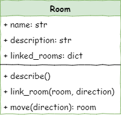

# Stage 2 - Movement

```{topic} In this lesson you will:

- Move between rooms
- Create the main loop
```

<iframe width="560" height="315" src="https://www.youtube-nocookie.com/embed/hZd1FcDApCI" title="YouTube video player" frameborder="0" allow="accelerometer; autoplay; clipboard-write; encrypted-media; gyroscope; picture-in-picture; web-share" allowfullscreen></iframe>

## Introduction

In Stage 1 we created three rooms, link them together, and got the program to describe them. While that was necessary, it doesn't make for a very good adventure game. So, in Stage 2 we will add code that allows the user to move between rooms, and we will create the **main loop**.

The main loop is an essential aspect of **event-driven programming**. Our **main.py** will initialize the game, creating all the necessary objects. It will then enter in **main loop** where it will wait for the user to provide input, and then respond to this imput.

```{admonition} Event driven programming
Event-driven programming is a type of computer programming where the order of tasks is determined by events, like a user clicking a button or receiving information from a sensor. 

Instead of following a set plan like in traditional programming, the program waits for events to happen and then reacts to them. This makes the program more flexible and able to change as needed.
```

To achieve this we will need to complete the following steps:

1. Create the `move` method
2. Initialize the starting room
3. Create the main loop which:
   - describes current room
   - accepts user input
   - responds to user input

### Class Diagram

We have updated the `Room` class diagram to reflect the Stage 2 work.



Notice we have a new method `move(direction):room`

- accepts one argument (direction)
- returns a `Room` object

## Create the move method

Open the **room.py** file and add the code highlighted below:

```{code-block} python
:linenos:
:emphasize-lines: 22-28
# room.py

class Room():
    
    def __init__(self,room_name):
        # initialises the room object
        self.name = room_name.lower()
        self.description = None
        self.linked_rooms = {}
        
    def describe(self):
        # sends a description of the room to the terminal
        print(f"\nYou are in the {self.name}")
        print(self.description)
        for direction in self.linked_rooms.keys():
            print(f"To the {direction} is the {self.linked_rooms[direction].name}")
    
    def link_rooms(self, room_to_link, direction):
        # links the provided room, in the provided direction
        self.linked_rooms[direction.lower()] = room_to_link
        
    def move(self, direction):
        # returns the room linked in the given direction
        if direction in self.linked_rooms.keys():
            return self.linked_rooms[direction]
        else:
            print("You can't go that way")
            return self
```

We need to create the **main loop** before we call this code, but let's **investigate** our new code anyway.

- `def move(self, direction):` &rarr;  defines the `move` method which accepts one argument: `direction`
- `# returns the room linked in the given direction` &rarr;  comment to explain the method
- `if direction in self.linked_rooms.keys():` &rarr;  checks if passed `direction` is a valid option
  - `self.linked_rooms.keys()`
    - gets all the `keys` from the `linked_rooms` attribute for this `Room` object
    - since the `keys` are the directions of the linked rooms, this list is a list of all the valid directions.
  - `if direction in` &rarr;  checks if the provided direction is in the list of valid directions
- `return self.linked_rooms[direction]` &rarr; if the direction is valid, the `Room` object in that direction will be returned
- `self.linked_rooms[direction]` &rarr; get the `Room` object for the provided `direction`
- `else:` &rarr;  if the provided direction is not valid, then this block will be executed.
- `print("You can't go that way")` &rarr; lets the user know the direction is not valid
- `return self` &rarr; since the user cannot move into another room, the method returns the current `Room` object (`self`)

## Initialize starting room

Now go to the **main.py** file and make the highlighted changes below

```{code-block} python
:linenos:
:emphasize-lines: 21-26, 28-29
# main.py

from room import Room

# create rooms
cavern = Room("Cavern")
cavern.description = ("A room so big that the light of your torch doesn’t reach the walls.")

armoury = Room("Armoury")
armoury.description = ("The walls are lined with racks that once held weapons and armour.")

lab = Room("Laboratory")
lab.description = ("A strange odour hangs in a room filled with unknownable contraptions.")

# link rooms
cavern.link_rooms(armoury,"south")
armoury.link_rooms(cavern,"north")
armoury.link_rooms(lab,"east")
lab.link_rooms(armoury,"west")

'''
# describe the rooms
cavern.describe()
armoury.describe()
lab.describe()
'''

# initialise variables
current_room = cavern
```

Let's **investigate** the new code

- the `'''` at lines 21 and 26 turns the room descriptions in a comment block, so the program will ignore them
  - you could simply delete these lines, but by **commenting them out** they are still available if you need them for debugging purposes.
- `# initialise variables` &rarr; a code structure comment
- `current_room = cavern` 
  - creates a variable to keep track of the current room the player is in.
  - sets the initial `current_room` as the `cavern` `Room` object

## Create main loop

Still working in the **main.py** file, we will now make the main loop.

Add the code highlighted below to have our first look at the main loop code

```{code-block} python
:linenos:
:emphasize-lines: 30, 32-36
# main.py

from room import Room

# create rooms
cavern = Room("Cavern")
cavern.description = ("A room so big that the light of your torch doesn’t reach the walls.")

armoury = Room("Armoury")
armoury.description = ("The walls are lined with racks that once held weapons and armour.")

lab = Room("Laboratory")
lab.description = ("A strange odour hangs in a room filled with unknownable contraptions.")

# link rooms
cavern.link_rooms(armoury,"south")
armoury.link_rooms(cavern,"north")
armoury.link_rooms(lab,"east")
lab.link_rooms(armoury,"west")

'''
# describe the rooms
cavern.describe()
armoury.describe()
lab.describe()
'''

# initialise variables
current_room = cavern
running = True

# ----- MAIN LOOP -----
while running:
    current_room.describe()
    
    command = input("> ").lower()
```

Finally we can run our code, but don't forget **PRIMM**. **Predict** you think the program will do, then **run** the program.

```{admonition} Escaping an infinite loop
In Python, when you find yourself in an infinte loop, you can exit the loop my pressing `ctrl` + `c` on Windows or `control` + `C` on macOS.

In addition, if you are using Thonny, you can click the **stop** icon.
```

Let's **investigate** the new code line-by-line.

- `running = True` &rarr; used to keep the **main loop** running until the user exits.
  - this is called a **flag variable** which will be changed to `False` when the user chooses to exit
- `# ----- MAIN LOOP -----` &rarr; code structure comment. This is a major component, hence the capitalization.
- `while running:` &rarr; the start of our **main loop**
  - as long as `running` remains `True` the **main loop** will repeat
- `current_room.describe()` &rarr; calls the `describe` method for the `current_room`
  - initially this is the `cavern`
- `command = input("> ").lower()` &rarr; gets user input
  - `input("> ")` &rarr; places `"> "` on the screen as a prompt then accepts the user input
  - `.lower()` &rarr; converts the user input to all lowercase
  - `command =` &rarr; assigns the converted user input to the `command` variable

Notice that no matter what the user enters, the same thing repeats. That's because we have create the **main loop** and accepted the user's input, but we haven't responded to that input.

## Responding to commands

In Event Driven Programming the entering of user's commands is called an **event**. Now we have to create code that responds to those events. This kind of code is called an **event handler**.

Back in our **main.py** we're going to create an **event handler** to deal with the entry of a direction (`"north"`, `"south"`, `"east"` or `"west"`). Add the highlighted code.

```{code-block} python
:linenos:
:emphasize-lines: 38-39
# main.py

from room import Room

# create rooms
cavern = Room("Cavern")
cavern.description = ("A room so big that the light of your torch doesn’t reach the walls.")

armoury = Room("Armoury")
armoury.description = ("The walls are lined with racks that once held weapons and armour.")

lab = Room("Laboratory")
lab.description = ("A strange odour hangs in a room filled with unknownable contraptions.")

# link rooms
cavern.link_rooms(armoury,"south")
armoury.link_rooms(cavern,"north")
armoury.link_rooms(lab,"east")
lab.link_rooms(armoury,"west")

'''
# describe the rooms
cavern.describe()
armoury.describe()
lab.describe()
'''

# initialise variables
running = True
current_room = cavern

# ----- MAIN LOOP -----
while running:
    current_room.describe()
    
    command = input("> ").lower()
    
    if command in ["north", "south", "east", "west"]:
        current_room = current_room.move(command)
```

**Predict** you think the program will do, then **run** the program.

Let's **investigate** that code

- `if command in ["north", "south", "east", "west"]:` &rarr; execute code if the command is a direction
  - `["north", "south", "east", "west"]` &rarr; a list of all the acceptable directions
  - `if command in` &rarr; checks if `command` is one of the acceptable directions
- `current_room = current_room.move(command)` &rarr; gets the new room
  - `current_room.move(command)` &rarr; calls the `move` method passing the value of command (which is a direction)
  - `current_room =` assigns the returned `Room` object to the `current_room`

### Testing

```{admonition} Testing branching code
Whenever you test branching code, it is important to ensure you methodically test **all** possible branches.

To do this:
- create a table which lists every possible branch
- for each branch, list the expected results
- record the actual results
- idenfiy any discrepancies
```

Now that we can move between all our rooms, we can test that our code is working correctly. Draw up a  table to test each option. Below is an example of my table.

| Current Room | Command | Expected Result | Actual Result |
| :-- | :-- | :-- | :-- |
| cavern | `north` | `You can't go that way` | `You can't go that way` |
| cavern | `south` | armoury | armoury |
| cavern | `east` | `You can't go that way` | `You can't go that way` |
| cavern | `west` | `You can't go that way` | `You can't go that way` |
| armoury | `north` | cavern | cavern |
| armoury | `south` | `You can't go that way` | `You can't go that way` |
| armoury | `east` | lab | lab |
| armoury | `west` | `You can't go that way` | `You can't go that way` |
| lab | `north` | `You can't go that way` | `You can't go that way` |
| lab | `south` | `You can't go that way` | `You can't go that way` |
| lab | `east` | `You can't go that way` | `You can't go that way` |
| lab | `west` | armoury | armoury |

Notice that I tested each of the four directions in each of the three rooms in my dungeon.

### Exiting

Although the user can now move around our dungeon, they cannot exit the game. Now we need to make an **event handler** to deal with the user wanting to quit the game.

```{code-block} python
:linenos:
:emphasize-lines: 40-41
# main.py

from room import Room

# create rooms
cavern = Room("Cavern")
cavern.description = ("A room so big that the light of your torch doesn’t reach the walls.")

armoury = Room("Armoury")
armoury.description = ("The walls are lined with racks that once held weapons and armour.")

lab = Room("Laboratory")
lab.description = ("A strange odour hangs in a room filled with unknownable contraptions.")

# link rooms
cavern.link_rooms(armoury,"south")
armoury.link_rooms(cavern,"north")
armoury.link_rooms(lab,"east")
lab.link_rooms(armoury,"west")

'''
# describe the rooms
cavern.describe()
armoury.describe()
lab.describe()
'''

# initialise variables
running = True
current_room = cavern

# ----- MAIN LOOP -----
while running:
    current_room.describe()
    
    command = input("> ").lower()
    
    if command in ["north", "south", "east", "west"]:
        current_room = current_room.move(command)
    elif command == "quit":
        running = False
```

**Predict** you think the program will do, then **run** the program.

Make sure you test the **quit** option

Let's **investigate** that code

- `elif command == "quit":` &rarr; if the command is not an acceptable direction, then check if it is `quit`
- `running = False` change our **flag variable** to `False`
  - this means that when the loops returns to the top, `where running` will be `False` and the loop will exit.

### Capture incorrect commands

So the code now works with our directions and allows us to quit, but what happens if the user enters anything else? Well, the loop continues and just redescribes the `current_room`.

Really, we should be given the user feedback that they command is invalid. Let's do this.

Change **main.py** to include the highlighted code below.

```{code-block} python
:linenos:
:emphasize-lines: 42-43
# main.py

from room import Room

# create rooms
cavern = Room("Cavern")
cavern.description = ("A room so big that the light of your torch doesn’t reach the walls.")

armoury = Room("Armoury")
armoury.description = ("The walls are lined with racks that once held weapons and armour.")

lab = Room("Laboratory")
lab.description = ("A strange odour hangs in a room filled with unknownable contraptions.")

# link rooms
cavern.link_rooms(armoury,"south")
armoury.link_rooms(cavern,"north")
armoury.link_rooms(lab,"east")
lab.link_rooms(armoury,"west")

'''
# describe the rooms
cavern.describe()
armoury.describe()
lab.describe()
'''

# initialise variables
running = True
current_room = cavern

# ----- MAIN LOOP -----
while running:
    current_room.describe()
    
    command = input("> ").lower()
    
    if command in ["north", "south", "east", "west"]:
        current_room = current_room.move(command)
    elif command == "quit":
        running = False
    else:
        print("I don't understand.")
```

**Predict** you think the program will do, then **run** the program.

Make sure you test our error capturing by entering some incorrect commands.

Let's **investigate** the new code:

- `else:` &rarr; a catch-all option for any input which is not a recognised command.
- `print("I don't understand.")` &rarr; lets the user know their command doesn't make sense.