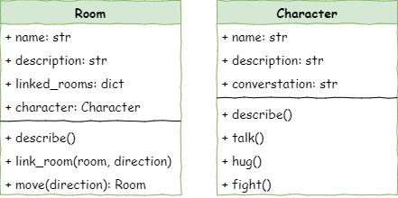

# Stage 3 - Character Creation

```{topic} In this lesson you will:

- Create characters
- Place the characters into their room
```

<iframe width="560" height="315" src="https://www.youtube-nocookie.com/embed/ufsmJYdUg1Y" title="YouTube video player" frameborder="0" allow="accelerometer; autoplay; clipboard-write; encrypted-media; gyroscope; picture-in-picture; web-share" allowfullscreen></iframe>

## Introduction

Now that the user has a dungeon that they can move around, we need to make it interesting. At this stage we will populate our dungeon with characters that the user can interact with.

To achieve this we will:

1. Define a character class
2. Create characters
3. Add characters to the rooms
4. Include characters in the room descriptions
5. Create character interactions
   - talk method
   - hug method
   - fight method
6. Add interactions to the main loop

### Class Diagram

The `Character` class is a new class, so it will require a second class diagram.

We also need to add a `character` attribute to the `Room` class so we can record who is in each room.



## Define the Character class

In Thonny create a new file and enter the code below. Then save it as **character.py** in the same folder as **main.py** and **room.py** (remember capitalisation).

```{code-block} python
:linenos:
:emphasize-lines: 1, 3, 5-9
# character.py

class Character():
    
    def __init__(self, name):
        # initialises the character object
        self.name = name
        self.description = None
        self.conversation = None
```

Let's investigate this code:

- `# character.py` &rarr; comment to identify the file we are working in
- `class Character():` &rarr; defining our new class called `Character`
- `def __init__(self, name):` &rarr; the dunder init method that is run whenever a `Character` object is created.
- `# initialises the character object` &rarr; explains the purpose of the method
- `self.name = name` &rarr; assigned the value passed in the `name` argument to this `Character` object's `name` attribute.
- `self.description = None` &rarr; creates a `description` attribute for the `Character` object
- `self.conversation = None` &rarr; creates a `converstaion` attribute for the `Character` object

## Create characters

Now that we have a `Character` class, we can go to **main.py** and create `Character` objects.

Open **main.py** and add the highlighted code below.

```{code-block} python
:linenos:
:emphasize-lines: 4, 22-24, 26-28
# main

from room import Room
from character import Character

# create rooms
cavern = Room("Cavern")
cavern.description = ("A room so big that the light of your torch doesn’t reach the walls.")

armoury = Room("Armoury")
armoury.description = ("The walls are lined with racks that once held weapons and armour.")

lab = Room("Laboratory")
lab.description = ("A strange odour hangs in a room filled with unknownable contraptions.")

# link rooms
cavern.link_rooms(armoury,"south")
armoury.link_rooms(cavern,"north")
armoury.link_rooms(lab,"east")
lab.link_rooms(armoury,"west")

# create characters
ugine = Character("Ugine")
ugine.description = "a huge troll with rotting teeth."

nigel = Character("Nigel")
nigel.description = "a burly dwarf with golden bead in woven through his beard."
nigel.conversation = "Well youngan, what are you doing here?"

'''
# describe the rooms
cavern.describe()
armoury.describe()
lab.describe()
'''
```

Investigating that code:

- `from character import Character` &rarr; get our `Character` class from the **character.py** file
- `# create characters` &rarr; code structure comment
- `ugine = Character("Ugine")` &rarr; creates a `Character` object with the name `Ugine` and assigns it to `ugine`
- `ugine.description = "a huge troll with rotting teeth."` &rarr; changes the `ugine` `description` attribute to `"a huge troll with rotting teeth."`
- `nigel = Character("Nigel")` &rarr; creates a `Character` object with the name `Nigel` and assigns it to `nigel`
- `nigel.description = "a burly dwarf with golden bead in woven through his beard."` &rarr; changes the `nigel` `description` attribute to `"a burly dwarf with golden bead in woven through his beard."`
- `nigel.conversation = "Well youngan, what are you doing here?"` &rarr; changes the `nigel` `conversation` attribute to `"Well youngan, what are you doing here?"`
- Note that we didn't change the `conversation` attribute for `ugine`. This means it will remain with the default value of `None`

## Add Characters to the Rooms

So now we have two classes that interact with each other, `Room` and `Character`. Now we need to work out how we represent that interaction in our class structures. Checking our class diagram you will notice that we have added a new `charcetr` attribute to the `Room` class. This is how we show which `Character` is in the each `Room`.


This is an arbitrary decision. We could easily had added the new attributer to the `Charcter` class showing this is the room the character is in. Both are valid. The important thing is to be consistent, and to document your decision for others to understand. That's why the class diagram is so important.

Return to **room.py** and add the highlighted line below.

```{code-block} python
:linenos:
:emphasize-lines: 8
# room.py

class Room():
    
    def __init__(self,room_name):
        # initialises the room object
        self.name = room_name.lower()
        self.description = None
        self.linked_rooms = {}
        self.character = None
        
    def describe(self):
        # sends a description of the room to the terminal
        print(f"\nYou are in the {self.name}")
        print(self.description)
        for direction in self.linked_rooms.keys():
            print(f"To the {direction} is the {self.linked_rooms[direction].name}")
    
    def link_rooms(self, room_to_link, direction):
        # links the provided room, in the provided direction
        self.linked_rooms[direction.lower()] = room_to_link
        
    def move(self, direction):
        # returns the room linked in the given direction
        if direction in self.linked_rooms.keys():
            return self.linked_rooms[direction]
        else:
            print("You can't go that way")
            return self
```

Investigating that code:

- `self.character = None` &rarr; creates a new attribute called `character` and assigns `None` to it.

The return to **main.py** and add characters to our rooms using the highlighted code below.

```{code-block} python
:linenos:
:emphasize-lines: 32-33
# main.py

from room import Room
from character import Character

# create rooms
cavern = Room("Cavern")
cavern.description = ("A room so big that the light of your torch doesn’t reach the walls.")

armoury = Room("Armoury")
armoury.description = ("The walls are lined with racks that once held weapons and armour.")

lab = Room("Laboratory")
lab.description = ("A strange odour hangs in a room filled with unknownable contraptions.")

# link rooms
cavern.link_rooms(armoury,"south")
armoury.link_rooms(cavern,"north")
armoury.link_rooms(lab,"east")
lab.link_rooms(armoury,"west")


# create characters
ugine = Character("Ugine")
ugine.description = "a huge troll with rotting teeth."

nigel = Character("Nigel")
nigel.description = "a burly dwarf with golden bead in woven through his beard."
nigel.conversation = "Well youngan, what are you doing here?"

# add characters to rooms
armoury.character = ugine
lab.character = nigel

'''
# describe the rooms
cavern.describe()
armoury.describe()
lab.describe()
'''

# initialise variables
running = True
current_room = cavern

# ----- MAIN LOOP -----
while running:
    current_room.describe()
    
    command = input("> ").lower()
    
    if command in ["north", "south", "east", "west"]:
        current_room = current_room.move(command)
    elif command == "quit":
        running = False
    else:
        print("I don't understand.")
```

Investigating the code:

- `armoury.character = ugine` &rarr; assigns the `ugine` `Character` object to the `character` attribute of the `armoury` `Room` object.
- `lab.character = nigel` &rarr; assigns the `nigel` `Character` object to the `character` attribute of the `lab` `Room` object.

Let's do some testing. **Predict** what you think will happen and then **Run** the program. It should do nothing new, unless there is an error. That's because we haven't adjusted the room descriptions to include the characters. Let's do that now.