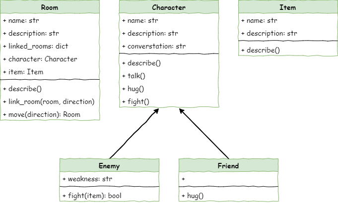

# Stage 5 - Item Creation

```{topic} Learning Intentions
In this lesson you will:
Knowledge
* understand what a class is and why objects might need their own attributes and behaviours
* explain how classes, attributes, and methods work together to define different kinds of objects
* describe how objects can be linked to form a larger system
* create a new class with attributes and a method that describes the object
* add objects to a structure and update output so these objects appear correctly when the program runs
```

<iframe width="560" height="315" src="https://www.youtube-nocookie.com/embed/jYSs_-wY8ys" title="YouTube video player" frameborder="0" allow="accelerometer; autoplay; clipboard-write; encrypted-media; gyroscope; picture-in-picture; web-share" allowfullscreen></iframe>

## Introduction

Our dungeon is starting to look like a real game. You can now move between rooms and meet different characters, and each type of character behaves in their own way.

Next, we’re going to make the dungeon feel more alive by adding items. Most dungeon-style games let players find and use different objects, so we’ll do the same.

In this stage you will:

```{admonition} Pseudocode
:class: pseudocode
* Make an Item class
* Create your own item objects
* Put those items into different rooms
* Update the room descriptions so the items show up when you enter a room
```

### Class Diagram

The new class diagram shows our new Items class, as well as the new item attribute in our Room class.



## Define the Item class

In Thonny create a new file and enter the code below. Then save it as ***item.py*** in the same folder as ***main.py***, ***character.py*** and ***room.py***.

```{code-block} python
:linenos:
:emphasize-lines: 1, 3, 5-8
# item.py

class Item():
    
    def __init__(self,name):
        # initialise the Item object
        self.name = name.lower()
        self.description = None
```

In investigating the code everything should be familiar:

```{admonition} Code Explaination
* We made the Item class.
* We wrote the `__init__` method that runs when you create a new item.
* We took the item’s name and stored it in `self.name`.
* We added `self.description` so we can give the item a description later.
```

## Create Item objects

To create the Item objects, move to the ***main.py*** file and add the code below:

```{code-block} python
:linenos:
:emphasize-lines: 5, 36-38, 40-41, 43-44
# main.py

from room import Room
from character import Enemy, Friend
from item import Item

# create rooms
cavern = Room("Cavern")
cavern.description = ("A room so big that the light of your torch doesn’t reach the walls.")

armoury = Room("Armoury")
armoury.description = ("The walls are lined with racks that once held weapons and armour.")

lab = Room("Laboratory")
lab.description = ("A strange odour hangs in a room filled with unknownable contraptions.")

# link rooms
cavern.link_rooms(armoury,"south")
armoury.link_rooms(cavern,"north")
armoury.link_rooms(lab,"east")
lab.link_rooms(armoury,"west")

# create characters
ugine = Enemy("Ugine")
ugine.description = "a huge troll with rotting teeth."
ugine.weakness = "cheese"

nigel = Friend("Nigel")
nigel.description = "a burly dwarf with golden bead in woven through his beard."
nigel.conversation = "Well youngan, what are you doing here?"

# add characters to rooms
armoury.character = ugine
lab.character = nigel

# create items
cheese = Item("Cheese")
cheese.description = "super smelly"

chair = Item("Chair")
chair.description = "designed to be sat on"

elmo = Item("Elmo")
elmo.description = "wanting to be tickled"

'''
# describe the rooms
cavern.describe()
armoury.describe()
lab.describe()
'''

# initialise variables
running = True
current_room = cavern

# ----- MAIN LOOP -----
while running:
    current_room.describe()
    
    command = input("> ").lower()
    
    if command in ["north", "south", "east", "west"]:
        current_room = current_room.move(command)
    elif command == "talk":
        if current_room.character is not None:
            current_room.character.talk()
        else:
            print("There is no one here to talk to")
    elif command == "hug":
        if current_room.character is not None:
            current_room.character.hug()
        else:
            print("There is no one here to hug")
    elif command== "fight":
        if current_room.character is not None:
            weapon = input("What will you fight with? > ").lower()
            if current_room.character.fight(weapon):
                current_room.character = None
            else:
                running = False
        else:
            print("There is no one here to fight")
    elif command == "quit":
        running = False
    else:
        print("I don't understand.")
```

**Predict** what you think will happen and **run** the code.

Again, in investigating the code this should all be familiar.

```{admonition} Code Explaination
For each item, we did the following:

* Imported the Item class.
* Used `Item()` to make a new item and stored it in a variable.
* Gave the item a description by setting its `description` attribute.
```

## Add the item object to the the rooms.

To put items into rooms, we first need to update the `Room` class. Open ***room.py*** and add the code shown.

```{code-block} python
:linenos:
:emphasize-lines: 11
# room.py

class Room():
    
    def __init__(self,room_name):
        # initialises the room object
        self.name = room_name.lower()
        self.description = None
        self.linked_rooms = {}
        self.character = None
        self.item = None
        
    def describe(self):
        # sends a description of the room to the terminal
        print(f"\nYou are in the {self.name}")
        print(self.description)
        if self.character is not None:
            self.character.describe()
        for direction in self.linked_rooms.keys():
            print(f"To the {direction} is the {self.linked_rooms[direction].name}")
    
    def link_rooms(self, room_to_link, direction):
        # links the provided room, in the provided direction
        self.linked_rooms[direction.lower()] = room_to_link
        
    def move(self, direction):
        # returns the room linked in the given direction
        if direction in self.linked_rooms.keys():
            return self.linked_rooms[direction]
        else:
            print("You can't go that way")
            return self
```

Save the ***room.py*** file and then return to the ***main.py*** file, add the highlighted code:

```{code-block} python
:linenos:
:emphasize-lines: 46-49
# main.py

from room import Room
from character import Enemy, Friend
from item import Item

# create rooms
cavern = Room("Cavern")
cavern.description = ("A room so big that the light of your torch doesn’t reach the walls.")

armoury = Room("Armoury")
armoury.description = ("The walls are lined with racks that once held weapons and armour.")

lab = Room("Laboratory")
lab.description = ("A strange odour hangs in a room filled with unknownable contraptions.")

# link rooms
cavern.link_rooms(armoury,"south")
armoury.link_rooms(cavern,"north")
armoury.link_rooms(lab,"east")
lab.link_rooms(armoury,"west")

# create characters
ugine = Enemy("Ugine")
ugine.description = "a huge troll with rotting teeth."
ugine.weakness = "cheese"

nigel = Friend("Nigel")
nigel.description = "a burly dwarf with golden bead in woven through his beard."
nigel.conversation = "Well youngan, what are you doing here?"

# add characters to rooms
armoury.character = ugine
lab.character = nigel

# create items
cheese = Item("Cheese")
cheese.description = "super smelly"

chair = Item("Chair")
chair.description = "designed to be sat on"

elmo = Item("Elmo")
elmo.description = "wanting to be tickled"

# add items to rooms
cavern.item = chair
armoury.item = elmo
lab.item = cheese

'''
# describe the rooms
cavern.describe()
armoury.describe()
lab.describe()
'''

# initialise variables
running = True
current_room = cavern

# ----- MAIN LOOP -----
while running:
    current_room.describe()
    
    command = input("> ").lower()
    
    if command in ["north", "south", "east", "west"]:
        current_room = current_room.move(command)
    elif command == "talk":
        if current_room.character is not None:
            current_room.character.talk()
        else:
            print("There is no one here to talk to")
    elif command == "hug":
        if current_room.character is not None:
            current_room.character.hug()
        else:
            print("There is no one here to hug")
    elif command== "fight":
        if current_room.character is not None:
            weapon = input("What will you fight with? > ").lower()
            if current_room.character.fight(weapon):
                current_room.character = None
            else:
                running = False
        else:
            print("There is no one here to fight")
    elif command == "quit":
        running = False
    else:
        print("I don't understand.")
```

**Predict** what you think will happen and then **run** the program.

Investigating these two code changes should look familiar to you.

```{admonition} Code Explaination
* We added an `item` attribute to the Room class.
* We made three items:
  * each item was given a name
  * each item was given a description
* We placed one item into each room.
```

## Include the Item objects in the room description

Even though you've added all this new code, the program will still look the same when it runs. That’s because we haven’t told it to show the items yet. To fix this, we’ll do the same thing we did for characters:

* Make a `describe` method inside the Item class.
* Make the Room’s `describe` method call the item’s `describe` method.

First we need to go to the ***item.py*** file and add the code below:

```{code-block} python
:linenos:
:emphasize-lines: 10-12
# item.py

class Item():
    
    def __init__(self,name):
        # initialise the Item object
        self.name = name.lower()
        self.description = None

    def describe(self):
        # prints description of item to the terminal
        print(f"You see {self.name} in the room. It is {self.description}.")    
```

In investing this code, you should already recognise all these elements:

* defining method
* describing the method in a comment
* displaying attributes to the terminal

Now head to ***room.py*** and add the following code:

```{code-block} python
:linenos:
:emphasize-lines: 19-20
# room.py

class Room():
    
    def __init__(self,room_name):
        # initialises the room object
        self.name = room_name.lower()
        self.description = None
        self.linked_rooms = {}
        self.character = None
        self.item = None
        
    def describe(self):
        # sends a description of the room to the terminal
        print(f"\nYou are in the {self.name}")
        print(self.description)
        if self.character is not None:
            self.character.describe()
        if self.item is not None:
            self.item.describe()
        for direction in self.linked_rooms.keys():
            print(f"To the {direction} is the {self.linked_rooms[direction].name}")
    
    def link_rooms(self, room_to_link, direction):
        # links the provided room, in the provided direction
        self.linked_rooms[direction.lower()] = room_to_link
        
    def move(self, direction):
        # returns the room linked in the given direction
        if direction in self.linked_rooms.keys():
            return self.linked_rooms[direction]
        else:
            print("You can't go that way")
            return self
```

**Predict** and **run** the code. 

**Investigate** the code and you will notice that it is very similar to the character description:

- check if there is an item in the room
- when an item is present, call it's describe method.

Go a step further and test the code by going to each room and checking that the correct item is displayed.

| Room | Item expected | Item described |
| :--- | :------------ | :------------- |
| Cavern | chair | |
| Armoury | elmo | |
| Lab | cheese | |

## Stage 5 task

Now it is time for your to implement the **Make** phase.

You should:

- make an additional item for each of your additional rooms
- add your additional items to their room.

