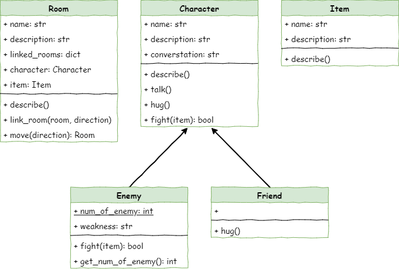

# Stage 7 - Victory Conditions

```{topic} Learning Intentions
In this lesson you will:
* Know the difference between class variables and normal (instance) variables in an OOP programme.
* Understand how objects can share information by using a class variable.
* Know when and where to put if-statements inside methods so an object can make decisions.
* Create and change class variables so objects can share the same data.
* Write methods that use if-statements to change what an object does based on what is happening in the programme.
```

<iframe width="560" height="315" src="https://www.youtube-nocookie.com/embed/hTGv542obJo" title="YouTube video player" frameborder="0" allow="accelerometer; autoplay; clipboard-write; encrypted-media; gyroscope; picture-in-picture; web-share" allowfullscreen></iframe>

## Introduction

We’re almost done with our text-based adventure game. You now have a dungeon where the player can move around, pick up items, and talk or fight with different characters. What happens in these interactions depends on the type of character they meet.

In this stage, you’re going to set up how the player wins the game.

You will do this by:

```{admonition} Pseudocode
:class: pseudocode
* counting how many enemies exist
* lowering that count each time an enemy is defeated
* checking when the count reaches zero so the player wins the game
```

### Class Diagram

Have a look at the class diagram for this stage and you’ll see something new.

The `Enemy` class now has:

* a `num_of_enemy` attribute
* a `get_num_of_enemy` method



The `num_of_enemy` attribute is underlined in the diagram. That underline shows it’s a **class variable**. A class variable is shared by every object made from that class. All `Enemy` objects can read it and change it, and whenever one object changes it, the others see the new value too.

In this game, `num_of_enemy` keeps track of how many `Enemy` objects exist, and every enemy you create will share that same number.

## Count Number of Enemies

To keep track of how many `Enemy` objects are in the game, we need to add a **class variable** to the `Enemy` class.

Open ***character.py*** and add the highlighted code shown below.

```{code-block} python
:linenos:
:emphasize-lines: 43, 49
# character.py

class Character():
    
    def __init__(self, name):
        # initialises the character object
        self.name = name
        self.description = None
        self.conversation = None
        
    def describe(self):
        # sends a description of the character to the terminal
        print(f"{self.name} is here, {self.description}")
        
    def talk(self):
        # send converstation to the terminal
        if self.conversation is not None:
            print(f"{self.name}: {self.conversation}")
        else:
            print(f"{self.name} doesn't want to talk to you")
    
    def hug(self):
        # the character responds to a hug
        print(f"{self.name} doesn't want to hug you")

    def fight(self,item):
        # the character response to a threat
        print(f"{self.name} doesn't want to fight you")
        return True
        
class Friend(Character):
    
    def __init__(self, name):
        # initialise the Friend object by calling the character initialise
        super().__init__(name)
        
    def hug(self):
        # the friend responds to a hug
        print(f"{self.name} hugs you back.")
        
class Enemy(Character):
    
    num_of_enemy = 0

    def __init__(self,name):
        # initialise the Enemy object by calling the character initialise
        super().__init__(name)
        self.weakness = None
        Enemy.num_of_enemy += 1
        
    def fight(self, item):
        # fights enemy with provided item and returns if player survives
        if item == self.weakness:
            print(f"You strike {self.name} down with {item}.")
            return True
        else:
            print(f"{self.name} crushes you. Puny adventurer")
            return False
```

Save the code, and **run** it to ensure there are no errors.

**Investigating** the code:

```{admonition} Code Explaination
* `num_of_enemy = 0` &rarr; this creates the **class variable**.
  * Class variables must be written **before** the `__init__` method.
  * They are indented once, at the same level as the methods.
  * It does **not** use `self` because it belongs to the whole class, not to one object.
* `Enemy.num_of_enemy += 1` &rarr; this adds 1 to `num_of_enemy` every time a new `Enemy` is created.
  * Because `__init__` runs whenever you make a new enemy, the total number of enemies goes up each time.
```

Now that we are keeping track of the number of enemies, but we can't see what that number is. So let's create a method to find out how many enemies are in the dungeon

Still working in ***character.py***, add the highlighted code below:

```{code-block} python
:linenos:
:emphasize-lines: 60-61
# character.py

class Character():
    
    def __init__(self, name):
        # initialises the character object
        self.name = name
        self.description = None
        self.conversation = None
        
    def describe(self):
        # sends a description of the character to the terminal
        print(f"{self.name} is here, {self.description}")
        
    def talk(self):
        # send converstation to the terminal
        if self.conversation is not None:
            print(f"{self.name}: {self.conversation}")
        else:
            print(f"{self.name} doesn't want to talk to you")
    
    def hug(self):
        # the character responds to a hug
        print(f"{self.name} doesn't want to hug you")

    def fight(self,item):
        # the character response to a threat
        print(f"{self.name} doesn't want to fight you")
        return True
        
class Friend(Character):
    
    def __init__(self, name):
        # initialise the Friend object by calling the character initialise
        super().__init__(name)
        
    def hug(self):
        # the friend responds to a hug
        print(f"{self.name} hugs you back.")
        
class Enemy(Character):
    
    num_of_enemy = 0

    def __init__(self,name):
        # initialise the Enemy object by calling the character initialise
        super().__init__(name)
        self.weakness = None
        Enemy.num_of_enemy += 1
        
    def fight(self, item):
        # fights enemy with provided item and returns if player survives
        if item == self.weakness:
            print(f"You strike {self.name} down with {item}.")
            return True
        else:
            print(f"{self.name} crushes you. Puny adventurer")
            return False

    def get_num_of_enemy():
        return Enemy.num_of_enemy
```

Let's investigate that method:

```{admonition} Code Explaination
* `def get_num_of_enemy():` &rarr; this creates the method.
  * It doesn’t have `self` because it’s not linked to one object; it works for the whole class.
* `return Enemy.num_of_enemy` &rarr; this gives back the current number of enemies.
  * The `Enemy.` part tells Python to use the **class variable** from the `Enemy` class.
```

## Reduce Enemy Count

We can now count how many enemies there are and check that number, but we also need to **lower** the count when the player beats an enemy.

The `fight` method in the `Enemy` class already runs code when an enemy is defeated, so we just need to add one extra line there.

Stay in ***character.py*** and add the highlighted line below.

```{code-block} python
:linenos:
:emphasize-lines: 55
# character.py

class Character():
    
    def __init__(self, name):
        # initialises the character object
        self.name = name
        self.description = None
        self.conversation = None
        
    def describe(self):
        # sends a description of the character to the terminal
        print(f"{self.name} is here, {self.description}")
        
    def talk(self):
        # send converstation to the terminal
        if self.conversation is not None:
            print(f"{self.name}: {self.conversation}")
        else:
            print(f"{self.name} doesn't want to talk to you")
    
    def hug(self):
        # the character responds to a hug
        print(f"{self.name} doesn't want to hug you")

    def fight(self,item):
        # the character response to a threat
        print(f"{self.name} doesn't want to fight you")
        return True
        
class Friend(Character):
    
    def __init__(self, name):
        # initialise the Friend object by calling the character initialise
        super().__init__(name)
        
    def hug(self):
        # the friend responds to a hug
        print(f"{self.name} hugs you back.")
        
class Enemy(Character):
    
    num_of_enemy = 0

    def __init__(self,name):
        # initialise the Enemy object by calling the character initialise
        super().__init__(name)
        self.weakness = None
        Enemy.num_of_enemy += 1
        
    def fight(self, item):
        # fights enemy with provided item and returns if player survives
        if item == self.weakness:
            print(f"You strike {self.name} down with {item}.")
            Enemy.num_of_enemy -= 1
            return True
        else:
            print(f"{self.name} crushes you. Puny adventurer")
            return False

    def get_num_of_enemy():
        return Enemy.num_of_enemy
```

Save the code before we **Investigate** it:

```{admonition} Code Explaination
* Line `53` already checks if the player wins the fight.
* `Enemy.num_of_enemy -= 1` makes the class variable go down by one when an enemy is defeated.
```

## Check for Victory

The player wins the game when every enemy has been defeated. When that happens, `Enemy.num_of_enemy` will be `0`. So we need to choose the right spot in the code to check for this.

In ***main.py***, line `89` is already where the game checks if the player wins, so that’s the best place to add our `num_of_enemy` check.

Add the highlighted code below:

```{code-block} python
:linenos:
:emphasize-lines: 92-94
# main.py

from room import Room
from character import Enemy, Friend
from item import Item

# create rooms
cavern = Room("Cavern")
cavern.description = ("A room so big that the light of your torch doesn’t reach the walls.")

armoury = Room("Armoury")
armoury.description = ("The walls are lined with racks that once held weapons and armour.")

lab = Room("Laboratory")
lab.description = ("A strange odour hangs in a room filled with unknownable contraptions.")

# link rooms
cavern.link_rooms(armoury,"south")
armoury.link_rooms(cavern,"north")
armoury.link_rooms(lab,"east")
lab.link_rooms(armoury,"west")


# create characters
ugine = Enemy("Ugine")
ugine.description = "a huge troll with rotting teeth."
ugine.weakness = "cheese"

nigel = Friend("Nigel")
nigel.description = "a burly dwarf with golden bead in woven through his beard."
nigel.conversation = "Well youngan, what are you doing here?"

# add characters to rooms
armoury.character = ugine
lab.character = nigel

# create items
cheese = Item("Cheese")
cheese.description = "super smelly"

chair = Item("Chair")
chair.description = "designed to be sat on"

elmo = Item("Elmo")
elmo.description = "wanting to be tickled"

# add items to rooms
cavern.item = chair
armoury.item = elmo
lab.item = cheese

'''
# describe the rooms
cavern.describe()
armoury.describe()
lab.describe()
'''

# initialise variables
running = True
current_room = cavern
backpack = []

# ----- MAIN LOOP -----
while running:
    current_room.describe()
    
    command = input("> ").lower()
    
    if command in ["north", "south", "east", "west"]:
        current_room = current_room.move(command)
    elif command == "talk":
        if current_room.character is not None:
            current_room.character.talk()
        else:
            print("There is no one here to talk to")
    elif command == "hug":
        if current_room.character is not None:
            current_room.character.hug()
        else:
            print("There is no one here to hug")
    elif command== "fight":
        if current_room.character is not None:
            weapon = input("What will you fight with? > ").lower()
            available_weapons = []
            for item in backpack:
                available_weapons.append(item.name)
            if weapon in available_weapons:
                if current_room.character.fight(weapon):
                    if isinstance(current_room.character, Enemy):
                        current_room.character = None
                        if Enemy.get_num_of_enemy() == 0:
                            print("You have slain all the enemies. You are victorious!")
                            running = False
                else:
                    running = False
            else:
                print(f"You don't have {weapon}")
                print(f"{current_room.character.name} strikes you down.")
                running = False
        else:
            print("There is no one here to fight")
    elif command == "take":
        if current_room.item is not None:
            backpack.append(current_room.item)
            print(f"You put {current_room.item.name} into your backpack")
            current_room.item = None
        else:
            print("There is nothing here to take")
    elif command == "backpack":
        if backpack == []:
            print("It is empty")
        else:
            print("You have:")
            for item in backpack:
                print(f"- {item.name.capitalize()}")
    elif command == "quit":
        running = False
    else:
        print("I don't understand.")
```

**Investigating** that code:

```{admonition} Code Explaination
* Line `89` makes sure this code only runs after the player defeats an enemy.
* `if Enemy.get_num_of_enemy() == 0:` checks if the class variable has reached `0`.
* `print("You have slain all the enemies. You are victorious!")` shows the win message.
* `running = False` stops the main loop so the game can end.
```

## Testing

Now time to test our code. 

**Predict** what you think will happen, then run your code. Make sure that you test that the player wins when they have defeated all the enemies.

